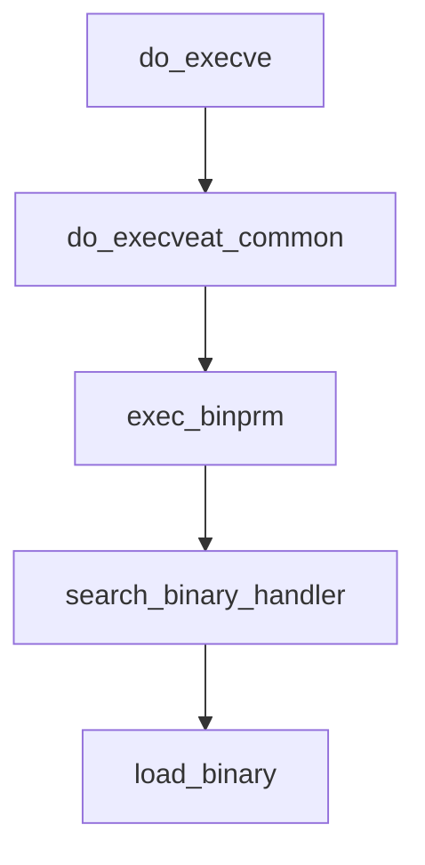

linux应用程序加载过程分析


## linux应用程序加载过程分析


### 目录


[TOC]


### 简介


进程在内存中主要占有几个部分，代码段、数据段、BSS、栈、堆等；其中，代码、数据、BSS的内容是可执行文件中对应的内容，加载程序并不是把它们的内容从可执行程序中填充到内存中，而是将它们的信息（基地址、长度等）更新到进程控制块task_struct中，当CPU第一次实际寻址执行的时候，会引起缺页中断，操作系统再将实际的内容从可执行文件中复制内容到物理内存中；程序执行过程中的动态分配内存操作是在堆中动态分配的；参数区在新进程加载的时候要存入环境变量和命令行参数列表，这些信息保存在栈中；


Linux系统运行应用程序时，有两种常见方法加载新程序，第一种：进程的加载过程从bash调用fork()提供调用创建一个新的进程开始；新进程调用execve()系统调用执行指定的elf可执行文件；第二种：在应用程序中使用exec系列函数调用执行新的程序；


#### shell命令行程序


在shell命令行中执行./可执行程序，经shell解析，该命令参数非shell内建命令，则认为是加载可执行文件；会调用fork()函数开始创建新进程，产生0x80中断，映射到系统调用函数sys_fork()，在sys_fork()函数中，进行一系列准备后，调用do_execve()函数，将可执行文件的程序头表加载到内存中，加载执行程序；


#### exec系列函数执行程序


为了执行一个新的可执行程序，Linux提供了系统调用execve()，而在C语言程序库中在此基础上给应用程序提供了一套库函数，包括execl()、execlp()、execle()、execleo()、execv()、execvp()及库函数system()；


exec系列函数可以把当前进程替换为一个新进程，即可以使用exec函数将程序的执行从一个程序切换到另一个程序；在新的程序启动后，原来的程序就不再运行了；新进程由exec系列函数的path或file参数指定；新程序启动时会把在argv数组中给定的参数传递给新程序；


系统调用exec通过调用load_elf_binary()函数，将应用程序对应的ELF二进制文件加载到进程的3GB大小的虚拟地址空间中；


### execve系统调用


execve()系统调用是通过do_execve()函数实现的；do_execve()函数是系统无关函数；


```c

// fs/exec.c

SYSCALL_DEFINE3(execve,

        const char __user *, filename,

        const char __user *const __user *, argv,

        const char __user *const __user *, envp)

{

    return do_execve(getname(filename), argv, envp);

}

```


通过参数，向do_execve()函数传递了可执行文件名filename，和指向程序的参数argv指针、环境变量envp指针；


filename：可执行文件路径和文件名；


argv：程序的参数字符串；


envp：环境变量字符串；


__user说明，指向程序参数的argv数组指针和指向环境变量的envp数组指针，及数组中所有的指针都位于虚拟地址空间的用户空间部分；


```c

int do_execve(struct filename *filename,

    const char __user *const __user *__argv,

    const char __user *const __user *__envp)

{

    struct user_arg_ptr argv = { .ptr.native = __argv };

    struct user_arg_ptr envp = { .ptr.native = __envp };

    return do_execveat_common(AT_FDCWD, filename, argv, envp, 0);

}

```


```c

static int do_execveat_common(int fd, struct filename *filename,

                  struct user_arg_ptr argv,

                  struct user_arg_ptr envp,

                  int flags)

{

    ......

    retval = exec_binprm(bprm);

    if (retval < 0)

        goto out;

    ......

}

```





#### linux_binprm


内核定义struct linux_binprm结构体，用来保存装入二进制文件所需的信息，包括可执行程序的路径、参数、环境变量等信息；


```c

// include/uapi/linux/binfmts.h

#define BINPRM_BUF_SIZE 128


// include/linux/binfmts.h

struct linux_binprm {

    char buf[BINPRM_BUF_SIZE];	// 保存可执行文件的头128字节

#ifdef CONFIG_MMU

    struct vm_area_struct *vma;

    unsigned long vma_pages;

#else

# define MAX_ARG_PAGES  32

    struct page *page[MAX_ARG_PAGES];

#endif

    struct mm_struct *mm;

    unsigned long p; /* current top of mem */

    unsigned int

        cred_prepared:1,/* true if creds already prepared (multiple

                 * preps happen for interpreters) */

        cap_effective:1;/* true if has elevated effective capabilities,

                 * false if not; except for init which inherits

                 * its parent's caps anyway */

#ifdef __alpha__

    unsigned int taso:1;

#endif

    unsigned int recursion_depth; /* only for search_binary_handler() */

    struct file * file;	// 要执行的文件

    struct cred *cred;  /* new credentials */

    int unsafe;     /* how unsafe this exec is (mask of LSM_UNSAFE_*) */

    unsigned int per_clear; /* bits to clear in current->personality */

    int argc, envc;	// 命令行参数和环境变量数目

    const char * filename;  /* Name of binary as seen by procps */

    const char * interp;    /* Name of the binary really executed. Most

                   of the time same as filename, but could be

                   different for binfmt_{misc,script} */

    unsigned interp_flags;

    unsigned interp_data;

    unsigned long loader, exec;

};

```


char buf[BINPRM_BUF_SIZE];用来保存ELF文件开头的128个字节，包含了ELF文件头和程序头表，用来构造进程的虚拟空间结构；


### do_execveat_common


do_execveat_common()函数用来执行一个新的可执行程序；do_execveat_common()函数的实现稍长，这里分段进行分析；


```c

static int do_execveat_common(int fd, struct filename *filename,

                  struct user_arg_ptr argv,

                  struct user_arg_ptr envp,

                  int flags)

{

    char *pathbuf = NULL;

    struct linux_binprm *bprm;

    struct file *file;

    struct files_struct *displaced;

    int retval;


    if (IS_ERR(filename))

        return PTR_ERR(filename);


    /*

     * We move the actual failure in case of RLIMIT_NPROC excess from

     * set*uid() to execve() because too many poorly written programs

     * don't check setuid() return code.  Here we additionally recheck

     * whether NPROC limit is still exceeded.

     */

    if ((current->flags & PF_NPROC_EXCEEDED) &&

        atomic_read(&current_user()->processes) > rlimit(RLIMIT_NPROC)) {

        retval = -EAGAIN;

        goto out_ret;

    }


    /* We're below the limit (still or again), so we don't want to make

     * further execve() calls fail. */

    current->flags &= ~PF_NPROC_EXCEEDED;

```


```c

    struct files_struct *displaced;

    ......

    retval = unshare_files(&displaced);

    if (retval)

        goto out_ret;

```


unshare_files()是Linux中名称空间的控制函数，files_struct是包含在进程文件描述符中的，表示一个进程打开文件的信息，包含打开文件列表等信息；unshare_files()函数用于复制打开文件列表；


执行exec()后，子进程共享父进程的打开文件列表，包括标准输入、输出、错误输出；


```c

    struct linux_binprm *bprm;

    ......

    retval = -ENOMEM;

    bprm = kzalloc(sizeof(*bprm), GFP_KERNEL);

    if (!bprm)

        goto out_files;

```


动态分配一个linux_binprm结构，用来保存装入二进制文件所需的信息，包括可执行程序的路径、参数、环境变量等信息；


```c

    retval = prepare_bprm_creds(bprm);

    if (retval)

        goto out_free;

```


prepare_bprm_creds()函数，用户复制当前进程的cred结构，并增加引用计数；


```c

    check_unsafe_exec(bprm);

    current->in_execve = 1;

```


```c

    file = do_open_execat(fd, filename, flags);

    retval = PTR_ERR(file);

    if (IS_ERR(file))

        goto out_unmark;

```


由于要打开的时可执行文件，因此需要设置相应的标志位，再通过do_filp_open()函数打开文件，调用文件系统中的一些接口实现打开操作；


```c

    sched_exec();

```


sched_exec()函数用来选择负载最小的CPU，并完成CPU切换，使用负载最小的CPU来继续执行该进程；


```c

    bprm->file = file;

    if (fd == AT_FDCWD || filename->name[0] == '/') {

        bprm->filename = filename->name;

    } else {

        if (filename->name[0] == '\0')

            pathbuf = kasprintf(GFP_TEMPORARY, "/dev/fd/%d", fd);

        else

            pathbuf = kasprintf(GFP_TEMPORARY, "/dev/fd/%d/%s",

                        fd, filename->name);

        if (!pathbuf) {

            retval = -ENOMEM;

            goto out_unmark;

        }

        /*

         * Record that a name derived from an O_CLOEXEC fd will be

         * inaccessible after exec. Relies on having exclusive access to

         * current->files (due to unshare_files above).

         */

        if (close_on_exec(fd, rcu_dereference_raw(current->files->fdt)))

            bprm->interp_flags |= BINPRM_FLAGS_PATH_INACCESSIBLE;

        bprm->filename = pathbuf;

    }

    bprm->interp = bprm->filename;

```


```c

    retval = bprm_mm_init(bprm);

    if (retval)

        goto out_unmark;

```


bprm_mm_init()函数用来创建进程执行需要的虚拟内存，通过mm_alloc()函数创建新进程的mm_struct结构，再通过__bprm_mm_init()函数进行初始化；


```c

    bprm->argc = count(argv, MAX_ARG_STRINGS);

    if ((retval = bprm->argc) < 0)

        goto out;


    bprm->envc = count(envp, MAX_ARG_STRINGS);

    if ((retval = bprm->envc) < 0)

        goto out;

```


通过count()函数，获取argv和envp数组中字符串的个数；


```c

    retval = prepare_binprm(bprm);

    if (retval < 0)

        goto out;

```


prepare_binprm()函数获取一些可执行文件的信息，并保存到linux_binprm结构中，通过bprm_fill_uid()函数设置进程的uid和gid，通过security_bprm_set_creds()函数设置权限，最后通过kernel_read()函数将file中的内容读取到linux_binprm结构的buf中，即读取ELF文件的前128字节到bprm->buf；


```c

    retval = copy_strings_kernel(1, &bprm->filename, bprm);

    if (retval < 0)

        goto out;


    bprm->exec = bprm->p;

    retval = copy_strings(bprm->envc, envp, bprm);

    if (retval < 0)

        goto out;


    retval = copy_strings(bprm->argc, argv, bprm);

    if (retval < 0)

        goto out;

```


通过copy_strings()函数，从内核空间拷贝进程的文件名、环境变量、参数信息；


```c

    retval = exec_binprm(bprm);

    if (retval < 0)

        goto out;

```


exec_binprm()函数是do_execveat_common()中最核心的操作，用来执行linux_binprm结构中记录的ELF可执行文件；


#### exec_binprm


```c

static int exec_binprm(struct linux_binprm *bprm)

{

    pid_t old_pid, old_vpid;

    int ret;


    /* Need to fetch pid before load_binary changes it */

    old_pid = current->pid;

    rcu_read_lock();

    old_vpid = task_pid_nr_ns(current, task_active_pid_ns(current->parent));

    rcu_read_unlock();


    ret = search_binary_handler(bprm);

    if (ret >= 0) {

        audit_bprm(bprm);

        trace_sched_process_exec(current, old_pid, bprm);

        ptrace_event(PTRACE_EVENT_EXEC, old_vpid);

        proc_exec_connector(current);

    }


    return ret;

}

```


exec_binprm()函数通过search_binary_handler()函数，识别可执行程序类型，并执行该ELF程序；


在do_execveat_common()函数中执行如下操作：


1）调用unshare_files()函数为进程复制一份文件表；


2）调用kzalloc()分配struct linux_binprm结构体；


3）调用prepare_bprm_creds()


4）调用check_unsafe_exec()


5）调用do_open_execat()函数查找并打开二进制文件；


6）调用sched_exec()找到最小负载的CPU，用该CPU执行该二进制文件；


7）根据获取的信息，给struct linux_binprm结构体中的file、filename、interp、argc、envc、exec成员赋值；


8）调用bprm_mm_init()函数创建进程的内存地址空间，为新程序初始化内存管理；


9）调用prepare_binprm()检查该二进制文件的可执行权限；


10）调用copy_strings_kernel()函数从内核空间获取二进制文件的路径名称；


11）调用copy_strings()函数从用户空间拷贝命令行参数和环境变量；


12）二进制文件已经被打开，struct linux_binprm结构体中记录了可执行程序的重要信息，内核调用exec_binprm()函数执行可执行程序；


#### search_binary_handler


search_binary_handler()函数识别二进制程序，根据可执行文件的类型（如：shell、a.out、ELF等），查找相应的处理函数，查询能够处理当前对应可执行文件格式的处理函数；系统为每种文件类型创建了一个struct linux_binfmt结构体并保存在formats链表中，需要执行时遍历链表找到相应类型的结构，调用struct linux_binfmt结构体中对应的load_binary方法，加载可执行文件；


```c

int search_binary_handler(struct linux_binprm *bprm)

{

    ......

 retry:

    read_lock(&binfmt_lock);

    list_for_each_entry(fmt, &formats, lh) {	// 遍历formats链表

        if (!try_module_get(fmt->module))

            continue;

        read_unlock(&binfmt_lock);

        bprm->recursion_depth++;

        retval = fmt->load_binary(bprm);	// 通过load_binary()加载可执行程序

        read_lock(&binfmt_lock);

        put_binfmt(fmt);

        bprm->recursion_depth--;

    }

    read_unlock(&binfmt_lock);

    ......

}

```


#### load_binary


load_binary()函数用来加载可执行程序；


#### linux_binfmt


Linux内核支持多种可执行程序格式，内核对所支持的每种格式都被注册为一个linux_binfmt结构；struct linux_binfmt结构体保存处理相应格式的可执行文件的函数指针；


```c

// include/linux/binfmts.h

struct linux_binfmt {

    struct list_head lh;

    struct module *module;

    int (*load_binary)(struct linux_binprm *);	// 加载新的进程

    int (*load_shlib)(struct file *);	// 加载动态共享库

    int (*core_dump)(struct coredump_params *cprm);	// 将当前进程上下文保存到文件

    unsigned long min_coredump; /* minimal dump size */

};

```


linux_binfmt结构体中提供了3种方法来加载、执行可执行程序：


	a) load_binary：读取存放在可执行文件中的信息为当前进程建立一个新的执行环境；


	b) load_shlib：用于动态地把一个共享库捆绑到一个已经运行的进程，是由uselib()系统调用激活的；


	c) core_dump：在core文件中存放当前进程的执行上下文，该文件通常在进程接收到一个”dump”信号时创建，格式取决于可执行程序类型；


Linux支持的可执行程序格式举例：


| 格式        | linux_binfmt     | load_binary           |

| ----------- | ---------------- | --------------------- |

| a.out       | aout_format      | load_aout_binary      |

| flat        | flat_format      | load_flat_binary      |

| script脚本  | script_format    | load_script           |

| misc_format | misc_format      | load_misc_binary      |

| em86        | em86_format      | load_format           |

| elf_fdpic   | elf_fdpic_format | load_elf_fdpic_binary |

| elf         | elf_format       | load_elf_binary       |


struct linux_binfmt结构体保存在内核管理的链表中，链表头是formats，可以通过register_binfmt()函数将struct linux_binfmt结构体添加到该链表中，通过unregister_binfmt()函数将struct linux_binfmt结构体从该链表中删除；


```c

// include/linux/binfmts.h

/* Registration of default binfmt handlers */

static inline void register_binfmt(struct linux_binfmt *fmt)

{

    __register_binfmt(fmt, 0);

}


// fs/exec.c

void __register_binfmt(struct linux_binfmt * fmt, int insert)

{

    BUG_ON(!fmt);

    if (WARN_ON(!fmt->load_binary))

        return;

    write_lock(&binfmt_lock);

    insert ? list_add(&fmt->lh, &formats) :

         list_add_tail(&fmt->lh, &formats);

    write_unlock(&binfmt_lock);

}

EXPORT_SYMBOL(__register_binfmt);


void unregister_binfmt(struct linux_binfmt * fmt)

{

    write_lock(&binfmt_lock);

    list_del(&fmt->lh);

    write_unlock(&binfmt_lock);

}

EXPORT_SYMBOL(unregister_binfmt);

```


在系统启动时，内核为编译进内核的每个可执行格式都执行register_binfmt()函数；在实现一个新可执行格式的模块在被装载时，也执行register_binfmt()函数，当该模块被卸载时，执行unregister_binfmt()函数；


在执行可执行程序时，内核在search_binary_handler()函数中，通过list_for_each_entry()宏遍历所有注册的linux_binfmt对象，用已注册的load_binrary方法来加载和解析ELF格式的可执行文件，用注册的load_shlib方法来加载和解析ELF格式的动态链接库；


其中linux_binfmt对象的load_binary和load_shlib函数指针指向的就是一个可执行程序和动态链接库的处理函数；针对elf格式的linux_binfmt对象elf_format，如下：


```c

// fs/binfmt_elf.c

static struct linux_binfmt elf_format = {

    .module     = THIS_MODULE,

    .load_binary    = load_elf_binary,

    .load_shlib = load_elf_library,

    .core_dump  = elf_core_dump,

    .min_coredump   = ELF_EXEC_PAGESIZE,

};

```


elf_format对象用来支持ELF文件的执行操作，必须像内核注册elf_format结构，加入到内核支持的可执行程序的队列；


```c

// fs/binfmt_elf.c

static int __init init_elf_binfmt(void)

{

    register_binfmt(&elf_format);

    return 0;

}


static void __exit exit_elf_binfmt(void)

{

    /* Remove the COFF and ELF loaders. */

    unregister_binfmt(&elf_format);

}


core_initcall(init_elf_binfmt);

module_exit(exit_elf_binfmt);

```


#### load_elf_binary


在运行程序时，扫描注册linux_binfmt对象的formats链表，依次调用各个数据结构所提供的load处理程序来加载；ELF文件的加载程序为load_elf_binary()函数；load_elf_binary()函数先读入ELF文件头，并解析出头部包含的信息，扫描程序段表，找到类型为PT_LOAD的段，将其映射到内存的固定地址上；load_elf_binary()函数的实现代码比较长，详细分析请参考下一节《linux应用程序加载过程-load_elf_binary》；


load_elf_binary()函数执行的最后，使用start_thread()函数，修改pt_regs中保存的PC等寄存器的值，使其指向加载的应用程序入口；内核操作结束，从内核态返回用户态时，eip寄存器就直接跳转到ELF程序的入口地址了；新的程序开始执行，ELF文件装载完毕；


### 总结


在shell中执行应用程序的过程简化为：shell进程fork一个子进程，子进程使用execve()操作，使用对应文件格式的操作函数，将应用程序的ELF文件加载到内存；如果应用程序使用了动态链接库，则加载动态链接器（程序解释器），再将应用程序用到的动态链接库加载到内存，并重定位；最后从应用程序的入口地址处开始执行；


### 参考资料


[Linux进程启动过程分析do_execve(可执行程序的加载和运行)---Linux进程的管理与调度（十一）](https://blog.csdn.net/gatieme/article/details/51594439)


[linux可执行文件的加载和运行](http://blog.chinaunix.net/uid-12127321-id-2957869.html)


[回到目录](#目录)