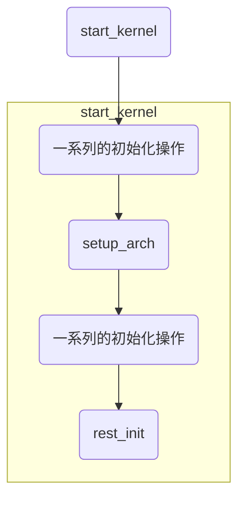
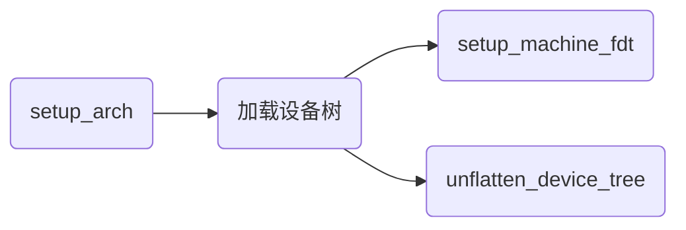
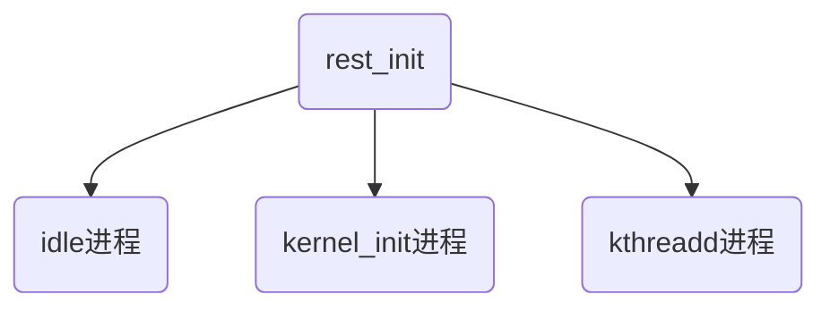
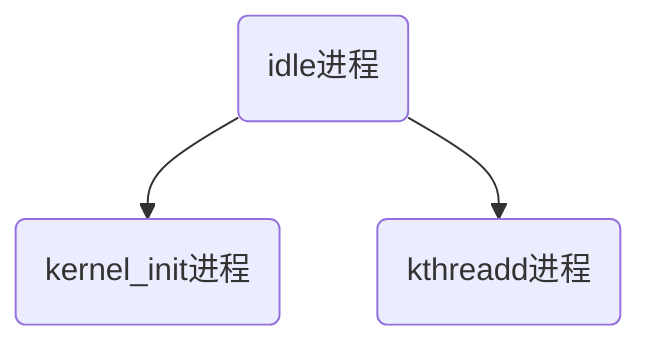
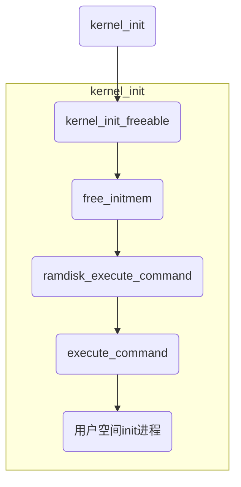
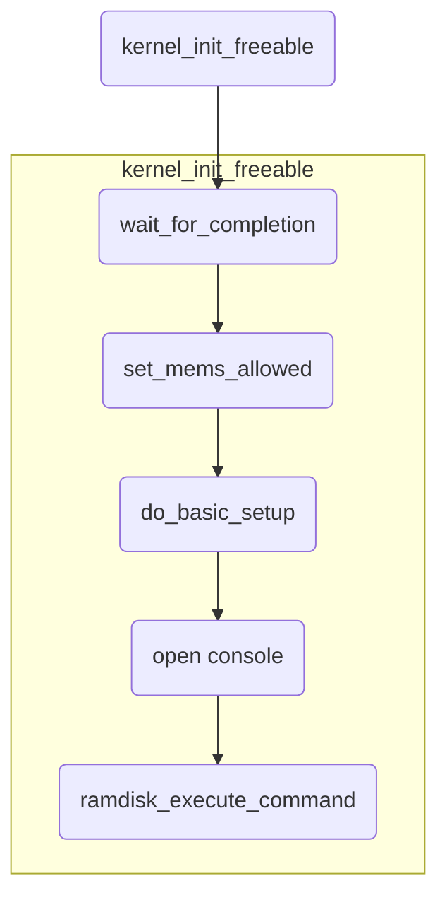
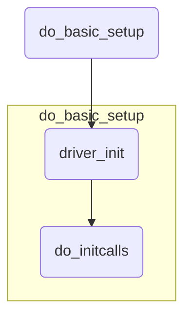
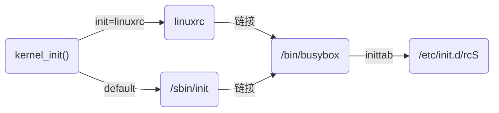

以arm64为例，简单讲述Linux在ARM64架构设备上系统启动的重要流程；


<!--more-->


### 目录


[TOC]


### 0. 简述


以arm64为例，讲述Linux在ARM64架构设备上的系统启动流程；


上电启动，系统启动要经过uboot、kernel、filesystem、ADM几个过程，如下：


在大多数系统中，内核镜像在uboot阶段被加载到内存中，并获得控制权开始内核的启动流程；


Linux内核版本：


```shell
linux-4.9.115
# uname -a
Linux vexpress 4.9.115 #2 SMP Wed Apr 1 22:49:35 CST 2020 aarch64 GNU/Linux
```

**说明**：由于Linux内核系统庞大繁杂，要想把内核启动中的每个细节都描述清楚，基本上不可能，更何况作者能力水平也达不到；因此，就在追踪内核启动流程代码的同时，只描述比较重要的几个部分；可以在以后的工作、学习中，随着水平的提高，不断地增加内容；


### 1. 目标文件


内核编译后生成的目标文件是ELF格式的vmlinux，vmlinux文件是各个源代码按照vmlinux.lds设定的规则，链接后得到的Object文件，并不是一个可执行的文件，不能在ARM平台上运行；通常会对其压缩，生成zImage或bzImage；通常内核映像以压缩格式存储，并不是一个可执行的内核；因此内核阶段需要先对内核映像自解压，他们的文件头部打包有解压缩程序；


#### 1.1 vmlinux.lds


vmlinux.lds文件是在内核编译时生成的，是被禁止编辑的；vmlinux.lds文件是在编译时，由vmlinux.lds.S文件对链接器ld的输出进行排序后生成；vmlinux.lds.S是用来对输出文件中的段进行排序，并定义相关的符号名；


```
arch/arm64/kernel/vmlinux.lds.S
```


在项目中通过make时指定的参数-O，将内核编译生成的所有目标文件，包括vmlinux.lds文件重定向输出到以下目录：


```shell
arch/arm64/kernel/vmlinux.lds
```


vmlinux.lds文件是链接脚本，在内核编译时，作为Makefile的链接器脚本，参与链接生成内核映像vmlinux；


总之：vmlinux是按照vmlinux.lds链接生成的，而vmlinux.lds是由vmlinux.lds.S生成的；


```C
// arch/arm64/kernel/vmlinux.lds
OUTPUT_ARCH(aarch64)	// 指定架构为aarch64
ENTRY(_text)			// 定义入口为_text
jiffies = jiffies_64;	// 定义为64位计数器
SECTIONS
{
    ......
    // 指定链接地址
    . = ((((0xffffffffffffffff - (1 << (48)) + 1) + (0)) + (0x08000000))) + 0x00080000;
    ......
}
```


关于段的信息

> text段，代码段，用来存放程序执行代码的一块内存区域；大小在程序运行前确定；
>
> data段，数据段，用来存放程序中已初始化的全局变量的内存区域；数据段属于静态内存分配；
>
> bss段，用来存放程序中未初始化的全局变量和静态变量的一块内存区域；属于静态内存分配；
>
> init段，Linux定义的一种初始化过程中才能用到的段；初始化完成后，该段内存会被释放；


关于地址的信息

> 加载地址：程序中指令和变量等加载到RAM上的地址；
>
> 运行地址：CPU执行一条程序的指令时的执行地址，即PC寄存器的值；就是要寻址到一个指令或变量所使用的地址；
>
> 链接地址：链接过程中链接器为指令和变量分配的地址；


#### 1.2 内核映像


vmlinux是未压缩的内核，是生成的纯内核二进制文件，具有用户定义的所有内核组件，但是这个vmlinux二进制文件是无法启动系统的；为了将Linux内核映像加载到内存并处于可执行状态，内核构建系统使用objcopy命令清除不必要的节区，压缩ELF格式的vmlinux，通过引导程序加载项和链接，生成可启动的最终的二进制文件zImage；


vmlinux通过gzip压缩成piggy.o，和head.o、misc.o链接生成zImage二进制文件；


vmlinuz是vmlinux的压缩文件


zImage默认的压缩内核映像文件，压缩vmlinux，加上一段解压启动代码，压缩而成；


uImage是u-boot使用bootm命令引导的Linux压缩内核映像文件格式，是使用mkimage工具对普通的压缩内核映像文件（zImage）加工而成；


uImage是uboot专用的内核映像文件，是在zImage之前加上一个长度为64字节的“头”，说明内核的版本、加载位置、生成时间、大小等信息；在地址0x40之后的部分，和zImage一样；其大小比zImage大64字节；


#### 1.3 设备树文件


Linux内核从3.x版本开始引入设备树的概念，用于实现驱动代码与设备信息分离；设备树出现之前，所有关于设备的具体信息都写在驱动中，外围设备变化，驱动代码就要跟着修改甚至是重写；引入设备树之后，驱动代码只负责处理驱动代码的逻辑，而关于设备的具体信息存放到设备树文件中，这样硬件接口信息变化时，只需要修改设备树文件信息，不需要修改驱动代码就可以；


一般情况下，在编译设备树之前，先在scripts/dtc/目录下，编译生成dtc工具scripts/dtc/dtc，再使用生成的dtc工具编译设备树源码，生成设备树文件；设备树源码和目标文件在arch/arm64/boot/dts/freescale/目录；


在Lx2160板项目中，目标文件会被重定向输出到target目录；


具体的设备树文件的加载、解析过程，会在下文setup_arch部分描述；


### 2. 内核启动第一阶段


Linux内核启动第一阶段，也就是我们常说的汇编阶段，也就是stext函数的实现内容；这部分主要完成的工作：CPU ID检查，machine ID检查，创建初始化页表，设置C代码运行环境，跳转到内核第一个真正的C函数start_kernel执行；


设置为SVC模式，关闭所有中断


获取CPUID，提取相应的proc info


验证tags或dtb


创建页表项


head.S文件中，


校验启动合法性


建立段式映射的页表并开启MMU


构建C运行环境，跳入C阶段


#### 2.1 内核启动入口点


内核是一个庞大的系统，通过vmlinux反向追踪启动入口点


Lx2160le板的交叉编译工具链：


```shell
CROSS_COMPILE=aarch64-linux-gnu-
```


通过对目标文件vmlinux的反向追溯，找到Linux执行的入口；


使用readelf命令可以查看vmlinux的入口地址为：0xffff000008080000


```shell
# readelf -h vmlinux
ELF Header:
  Magic:   7f 45 4c 46 02 01 01 00 00 00 00 00 00 00 00 00
  Class:                             ELF64
  Data:                              2's complement, little endian
  Version:                           1 (current)
  OS/ABI:                            UNIX - System V
  ABI Version:                       0
  Type:                              EXEC (Executable file)
  Machine:                           AArch64
  Version:                           0x1
  Entry point address:               0xffff000008080000
  Start of program headers:          64 (bytes into file)
  Start of section headers:          267014976 (bytes into file)
  Flags:                             0x0
  Size of this header:               64 (bytes)
  Size of program headers:           56 (bytes)
  Number of program headers:         4
  Size of section headers:           64 (bytes)
  Number of section headers:         39
  Section header string table index: 36
```


这个入口地址是怎么来的，对应内核代码中的哪个部分，可以通过反汇编来分析；


```shell
# aarch64-linux-gnu-objdump -dxh vmlinux > vmlinux.s
```


在得到的汇编文件vmlinux.s中查找入口地址：0xffff000008080000


```c
start address 0xffff000008080000

Disassembly of section .head.text:

ffff000008080000 <_text>:
ffff000008080000:       91005a4d        add     x13, x18, #0x16
ffff000008080004:       14437fff        b       ffff000009160000 <stext>
```


可以得到，Linux入口的第一条指令为：add     x13, x18, #0x16；对应的符号是：.head.text  _text；


而.head.text段，通过include/linux/init.h文件中的宏定义__HEAD来表示：


```C
/* For assembly routines */
#define __HEAD      .section    ".head.text","ax"	// "ax"表示所在段区域有可执行权限
#define __INIT      .section    ".init.text","ax"
```


内核启动的入口点，在arch/arm64/kernel/head.S文件中；


```c
    __HEAD
_head:
    /*
     * DO NOT MODIFY. Image header expected by Linux boot-loaders.
     */
#ifdef CONFIG_EFI
    /*
     * This add instruction has no meaningful effect except that
     * its opcode forms the magic "MZ" signature required by UEFI.
     */
    add x13, x18, #0x16
    b   stext
#else
    b   stext               // branch to kernel start, magic
    .long   0               // reserved
#endif
```


到此，已经找到，目标文件vmlinux的入口是arch/arm64/kernel/head.S文件中的__HEAD，在执行完第一条语句（add x13, x18, #0x16）之后，跳转到stext函数执行（b   stext）；所以，加载vmlinux后，第一个运行的函数是stext；


#### 2.2 stext函数


启动过程中的汇编阶段，是从arch/arm64/kernel/head.S文件开始，执行的起点是stext函数，入口函数是通过vmlinux.lds链接而成，在head.S中ENTRY(stext)指定；

在汇编代码中，宏定义ENTRY和ENDPROC是成对出现的，表示定义的一个函数，同时也要指明当前代码所在的段，如：__INIT；


```c
// arch/arm64/kernel/head.S
#define __INIT      .section    ".init.text","ax"

	__INIT
ENTRY(stext)
	......
ENDPROC(stext)
```


内核启动的必要条件：MMU关闭，D-cache关闭，x0是传递给FDT blob的物理地址；


```c
 * The requirements are:
 *   MMU = off, D-cache = off, I-cache = on or off,
 *   x0 = physical address to the FDT blob.
```


stext函数开始执行；


```c
// arch/arm64/kernel/head.S
	__INIT
ENTRY(stext)
    bl  preserve_boot_args	// Preserve the arguments passed by the bootloader in x0 ... x3
    bl  el2_setup           // Drop to EL1, w0=cpu_boot_mode
    adrp    x23, __PHYS_OFFSET
    and x23, x23, MIN_KIMG_ALIGN - 1    // KASLR offset, defaults to 0
    bl  set_cpu_boot_mode_flag
    bl  __create_page_tables

  /*
   * The following calls CPU setup code, see arch/arm64/mm/proc.S for
   * details.
   * On return, the CPU will be ready for the MMU to be turned on and
   * the TCR will have been set.
   */
     bl  __cpu_setup         // initialise processor
     b   __primary_switch
ENDPROC(stext)
```


##### 1. preserve_boot_args


保存从bootloader传递过来的x0 ~ x3参数；


```c
// arch/arm64/kernel/head.S
preserve_boot_args:
    mov x21, x0				// 将dtb的地址暂存在x21寄存器，释放出x0使用
    adr_l   x0, boot_args	// x0保存boot_args变量的地址
    stp x21, x1, [x0]		// 将x0、x1的值保存到boot_args[0]、boot_args[1]
    stp x2, x3, [x0, #16]	// 将x2、x3的值保存到boot_args[2]、boot_args[3]

    dmb sy              // needed before dc ivac with
                        // MMU off

    add x1, x0, #0x20		// x0、x1作为nval_cache_range函数的参数
    b   __inval_cache_range     // tail call
ENDPROC(preserve_boot_args)
```


##### 2. el2_setup


到此，CPU处于哪个exception level？根据ARM64 boot protocol，CPU处于EL2（推荐）或者secure EL1；如果处于EL2，需要将CPU退回到EL1；此部分还没有搞明白，暂时先跳过；


```c
// arch/arm64/kernel/head.S
ENTRY(el2_setup)
	......
ENDPROC(el2_setup)
```


##### 3. set_cpu_boot_mode_flag


set_cpu_boot_mode_flag函数，用来设置__boot_cpu_mode flag；需要一个前提条件：w20寄存器中保存了CPU启动时的异常等级（Exception level）；


```c
// arch/arm64/kernel/head.S
set_cpu_boot_mode_flag:
    adr_l   x1, __boot_cpu_mode
    cmp w0, #BOOT_CPU_MODE_EL2
    b.ne    1f
    add x1, x1, #4
1:  str w0, [x1]            // This CPU has booted in EL1
    dmb sy
    dc  ivac, x1            // Invalidate potentially stale cache line
    ret
ENDPROC(set_cpu_boot_mode_flag)
```


由于系统启动之后，需要了解CPU启动时候的Exception level，因此需要一个全局变量__boot_cpu_mode来保存启动时的CPU mode；


全局变量__boot_cpu_mode定义：


```c
ENTRY(__boot_cpu_mode)
    .long   BOOT_CPU_MODE_EL2
    .long   BOOT_CPU_MODE_EL1
```


##### 4. __create_page_tables


建立页表初始化的过程；


```c
// arch/arm64/kernel/head.S
__create_page_tables:
	......
ENDPROC(__create_page_tables)
```


##### 5. __cpu_setup


CPU的初始化设置；


```c
// arch/arm64/mm/proc.S
ENTRY(__cpu_setup)
	......
ENDPROC(__cpu_setup)
```


主要的内容包括：

> ```
> 1、cache和TLB的处理
> 2、Memory attributes lookup table的创建
> 3、SCTLR_EL1、TCR_EL1的设定
> ```


##### 6. __primary_switch


主要工作是为打开MMU做准备；


```c
// arch/arm64/kernel/head.S
__primary_switch:
	......
	bl  __enable_mmu			// 开启MMU
	......
    ldr x8, =__primary_switched
    adrp    x0, __PHYS_OFFSET
    blr x8
ENDPROC(__primary_switch)
```


在函数中通过\_\_enable\_mmu函数来开启MMU，并调用\_\_primary_switched函数；


```c
// arch/arm64/kernel/head.S
__primary_switched:
	......
    b   start_kernel
ENDPROC(__primary_switched)
```


在__primary_switched函数中，进行一些C环境的准备，并在最后，调用执行start_kernel函数，内核的启动进入到C语言环境阶段；


#### 2.3 参考资料


https://blog.csdn.net/xiaohua0877/article/details/78615776


http://www.wowotech.net/sort/armv8a_arch


### 3. 内核启动第二阶段


Linux内核启动的第二阶段也就是常说的C语言阶段，从start_kernel()函数开始；start_kernel()函数是所有Linux平台进入系统内核初始化后的入口函数；主要完成剩余的与硬件平台相关的初始化工作，这些初始化操作，有的是公共的，有的是需要配置才会执行的；内核工作需要的模块的初始化依次被调用，如：内存管理、调度系统、异常处理等；





#### 3.1 start_kernel


start_kernel()函数在init/main.c文件中，主要完成Linux子系统的初始化工作；此部分初始化内容繁多，暂时先略过，此处省略好多字；


```c
// init/main.c
asmlinkage __visible void __init start_kernel(void)
{
	......
}
```


```c
pr_notice("%s", linux_banner);
```


```c
const char linux_banner[] =
    "Linux version " UTS_RELEASE " (" LINUX_COMPILE_BY "@"
    LINUX_COMPILE_HOST ") (" LINUX_COMPILER ") " UTS_VERSION "\n";
```


执行的效果是，在内核启动初期，打印内核版本号和构建信息：


```shell
Linux version 4.9.115 (root@localhost.localdomain) (gcc version 6.2.0 20170314 ZTE Embsys-TSP V3.06.40 (GCC) ) #2 SMP PREEMPT Tue Mar 10 11:21:00 CST 2020
```


#### 3.2 setup_arch


setup_arch()函数，是体系结构相关的，该函数根据处理器、硬件平台具体型号设置系统；及解析系统命令行，系统内存管理初始化，统计并注册系统各种资源等；每个体系都有自己的setup_arch()函数，是由顶层Makefile中的ARCH变量定义的，我们使用的是ARCH=arm64，因此，这里的setup_arch()函数，也是arm64的体系结构相关的；参数是未被初始化的内部变量command_line；


```c
// init/main.c
asmlinkage __visible void __init start_kernel(void)
{
	......
	setup_arch(&command_line);
	......
}
```


setup_arch()函数中的初始化内容比较多，目前**只对设备树相关的部分进行简要描述**；


```c
// arch/arm64/kernel/setup.c
void __init setup_arch(char **cmdline_p)
{
    ......
	setup_machine_fdt(__fdt_pointer);
    ......
    if (acpi_disabled)
        unflatten_device_tree();
    ......
}
```





##### 1. setup_machine_fdt


setup_machine_fdt()函数的输入参数是设备树（DTB）首地址；uboot启动程序把设备树读取到内存中，之后在启动内核的同时，将设备树首地址传给内核，setup\_machine\_fdt()函数的参数\_\_fdt_pointer就是uboot传给内核的设备树地址；函数中的fdt(flat device tree)表示，设备树在内存中是在一块连续地址存储的；


```c
// arch/arm64/kernel/setup.c
static void __init setup_machine_fdt(phys_addr_t dt_phys)
{
    void *dt_virt = fixmap_remap_fdt(dt_phys);

    if (!dt_virt || !early_init_dt_scan(dt_virt)) {
		......
        while (true)
            cpu_relax();
    }

    dump_stack_set_arch_desc("%s (DT)", of_flat_dt_get_machine_name());
}
```


```c
// arch/arm64/kernel/setup.c
phys_addr_t __fdt_pointer __initdata;
```


全局变量\_\_fdt_pointer指向内存中的DTB，是设备树的物理地址；这个物理地址是由bootloader传递给内核的，在内核中使用，是需要转换为虚拟地址才能访问，而这个转换，由fixmap_remap_fdt()函数来完成；


```c
// drivers/of/fdt.c
bool __init early_init_dt_scan(void *params)
{
    bool status;

    status = early_init_dt_verify(params);
    if (!status)
        return false;

    early_init_dt_scan_nodes();
    return true;
}
```


接下来调用的early_init_dt_scan()函数，通过进一步调用early_init_dt_verify()函数来检查DTB数据是否完整，经过内存映射之后，就可以直接访问DTB中的内容了；


##### 2. unflatten_device_tree


unflatten_device_tree()函数完成对设备树的解析，所做的工作是将设备树各节点转换成相应的struct device_node结构体；


```c
// drivers/of/fdt.c
void __init unflatten_device_tree(void)
{
    __unflatten_device_tree(initial_boot_params, NULL, &of_root,
                early_init_dt_alloc_memory_arch, false);

    /* Get pointer to "/chosen" and "/aliases" nodes for use everywhere */
    of_alias_scan(early_init_dt_alloc_memory_arch);
}
```


```c
// drivers/of/base.c
struct device_node *of_root;
```


```c
static void *__unflatten_device_tree(const void *blob,
                     struct device_node *dad,
                     struct device_node **mynodes,
                     void *(*dt_alloc)(u64 size, u64 align),
                     bool detached)
{
	......
    /* First pass, scan for size */
	size = unflatten_dt_nodes(blob, NULL, dad, NULL);
	......
    /* Allocate memory for the expanded device tree */
	mem = dt_alloc(size + 4, __alignof__(struct device_node));
	......
    /* Second pass, do actual unflattening */
	unflatten_dt_nodes(blob, mem, dad, mynodes);
	......
}
```


\_\_unflatten\_device\_tree()函数中主要的解析函数是unflatten_dt_nodes()，在这里被调用了两次，第一次是扫描出设备树转换成struct device_node所需要的空间，然后系统申请内存空间，第二次是进行真正解析的工作；


```c
// drivers/of/fdt.c
static int unflatten_dt_nodes(const void *blob,
                  void *mem,
                  struct device_node *dad,
                  struct device_node **nodepp)
{
	......
	for (offset = 0;
         offset >= 0 && depth >= initial_depth;
         offset = fdt_next_node(blob, offset, &depth)) {
		fpsizes[depth+1] = populate_node(blob, offset, &mem,
                         nps[depth],
                         fpsizes[depth],
                         &nps[depth+1], dryrun);
		......
	}
	......
}
```


unflatten_dt_nodes()函数，就是从根节点开始，对子节点依次调用populate_node()，为当前节点申请内存空间，并对node进行初始化；并根据读取到的dtb中的内容，按节点进行填充；设备树由dtb二进制文件，经过解析为每一个节点生成一个struct device_node结构体，就完成了dtb的加载过程；


#### 3.3 console_init


console_init()函数执行控制台的初始化操作；在console_init()函数执行之前的printk打印信息，需要在console_init()函数执行之后才能打印出来；因为在console_inie()函数之前，printk的打印信息都保存在一个缓存区中，等到console_init()函数执行之后，控制台被初始化完成，就可以将缓冲区中的内容打印出来；


```c
// drivers/tty/tty_io.c
void __init console_init(void)
{
    initcall_t *call;

    /* Setup the default TTY line discipline. */
    n_tty_init();

    /*
     * set up the console device so that later boot sequences can
     * inform about problems etc..
     */
    call = __con_initcall_start;
    while (call < __con_initcall_end) {
        (*call)();
        call++;
    }
}
```


在console_init()函数中，指定initcall_t类型的函数指针，从\_\_con\_initcall\_start开始，到\_\_con\_initcall\_end结束，遍历这个范围之间的函数，依次运行；


\_\_con\_initcall\_start和\_\_con\_initcall\_end这两个地址，可以在vmlinux.lds文件找到；如下：


```c
// vmlinux.lds
__con_initcall_start = .;
KEEP(*(.con_initcall.init))
__con_initcall_end = .;
```


这两个地址之间，存放的是.con_initcall.init段的内容；


```c
// include/linux/init.h
#define console_initcall(fn)                    \
    static initcall_t __initcall_##fn           \
    __used __section(.con_initcall.init) = fn
```


通过宏定义console_initcall(fn)，将initcall_t类型的函数指针fn，存放到.con_initcall.init段；之后在调用console_init()函数时，就会通过遍历_\_con\_initcall\_start到\_\_con\_initcall\_end的地址区域，依次运行存放在其中的函数fn；


```c
// drivers/tty/serial/8250/8250_core.c
console_initcall(univ8250_console_init);
```

#### 3.4 rest_init


在进行一系列与内核相关的初始化后，在rest_init()函数中，启动了三个进程：idle、kernel_init、kthreadd，来开始操作系统的正式运行；


```c
// init/main.c
rest_init()
    kernel_thread(kernel_init, NULL, CLONE_FS);	// 创建kernel_init内核线程，即init，1号进程；
    pid = kernel_thread(kthreadd, NULL, CLONE_FS | CLONE_FILES);	// 创建kthreadd内核线程，2号进程，用于管理和调度其他内核线程；
    ......
    init_idle_bootup_task(current);	// 设置当前进程（0号进程）为idle进程；
    schedule_preempt_disabled();	// 调用进程调度，并禁止内核抢占；
    /* Call into cpu_idle with preempt disabled */
    cpu_startup_entry(CPUHP_ONLINE);	// 0号进程完成kernel初始化工作，进入idle循环，编程idle进程；
```





> - idle进程是操作系统的空闲进程，CPU空闲的时候会去运行它；
> - kernel_init进程最开始只是一个函数，作为进程被启动，init进程是永远存在的，PID是1；
> - kthreadd是内核守护进程，始终运行在内核空间，负责所有内核线程的调度和管理，PID是2；

也就是说，系统启动后的第一个进程是idle，idle进程是唯一没有通过kernel_thread或fork产生的进程；idle创建了kernel_init进程作为1号进程，创建了kthreadd进程作为2号进程；





#### 3.5 kernel_init


kernel_init()函数在创建kernel_init进程时，作为进程被启动；虽然kernel_init最开始只是一个函数，但是在最后，通过系统调用，将读取根文件系统下的init进程，完成从内核态到用户态的转变，转变为用户态的1号进程；这个init进程是所有用户态进程的父进程，产生了大量的子进程；init进程是1号进程，是永远存在的；





#### 3.6 kernel_init_freeable


等待内核线程kthreadd创建完成、注册内核驱动模块do_basic_setup、启动默认控制台/dev/console


完成设备初始化以及模块加载工作；





##### 3.6.1 wait_for_completion


```c
// init/main.c
kernel_init_freeable()
{
	wait_for_completion(&kthreadd_done);
}
```


使用完成量等待kthreadd_done，等待内核线程kthreadd创建完成；虽然kernel_init进程先创建，但是要在kthreadd线程创建完成才能执行；在threadd线程创建完成后才唤醒完成量，开始kernel_init进程的工作；


##### 3.6.2 do_basic_setup





###### 2. driver_init


driver_init()函数完成与驱动程序相关的所有子系统的构建，实现了Linux设备驱动的一个整体框架，但是它只是建立了目录结构，是设备驱动程序初始化的第一部分，具体驱动模块的装载在do_initcalls()函数中实现；


```c
// drivers/base/init.c
void __init driver_init(void)
{
    /* These are the core pieces */
    devtmpfs_init();	// 注册devtmpfs文件系统，启动devtmpfsd进程
    devices_init();		// 初始化驱动模型中的部分子系统，/dev/devices, /dev/char, /dev/block
    buses_init();		// 初始化驱动模型中的bus子系统
    classes_init();		// 初始化驱动模型中的class子系统
    firmware_init();	// 初始化驱动模型中的firmware子系统
    hypervisor_init();	// 初始化驱动模型中的hypervisor子系统

    /* These are also core pieces, but must come after the
     * core core pieces.
     */
    platform_bus_init();	// 初始化驱动模型中的bus/platform子系统，此节点是所有platform设备和驱动的总线模型；所有platform设备和驱动都会挂载到这个总线上；
    cpu_dev_init();		// 初始化驱动模型中的device/system/cpu子系统，该节点包含CPU相关属性；
    memory_dev_init();	// 初始化驱动模型中的device/system/memory子系统，该节点包含了内存相关属性；
    container_dev_init();	// 初始化系统总线类型为容器；
    of_core_init();		// 初始化创建，访问和结时设备树的过程；
}
```


###### 3. do_initcalls


编译器在编译内核时，将一系列模块初始化函数的起始地址按照一定顺序，放在名为section的段中；在内核启动的初始化阶段，do_initcalls()函数中以函数指针的形式取出这些函数的其实地址，依次运行，以完成相应模块的初始化操作，是设备驱动程序初始化的第二部分；由于内核模块可能存在依赖关系，即某些模块的初始化需要依赖其他模块的初始化来完成，因此这些模块的初始化顺序非常重要；


依次调用不同等级的初始化函数：


```c
// init/main.c
static void __init do_initcalls(void)
{
    int level;

    // 依次调用不同level等级的初始化函数
    for (level = 0; level < ARRAY_SIZE(initcall_levels) - 1; level++)
        do_initcall_level(level);
}
```


对于同一个level等级下的函数，依次遍历执行：


```c
// init/main.c
static void __init do_initcall_level(int level)
{
    initcall_t *fn;

    strcpy(initcall_command_line, saved_command_line);
    parse_args(initcall_level_names[level],
           initcall_command_line, __start___param,
           __stop___param - __start___param,
           level, level,
           NULL, &repair_env_string);

    // 对于同一个level等级下的函数，依次遍历执行；
    for (fn = initcall_levels[level]; fn < initcall_levels[level+1]; fn++)
        do_one_initcall(*fn);
}
```


开始执行某一个确定的函数：


```c
// init/main.c
int __init_or_module do_one_initcall(initcall_t fn)
{
    int count = preempt_count();
    int ret;
    char msgbuf[64];

    if (initcall_blacklisted(fn))
        return -EPERM;

    if (initcall_debug)
        ret = do_one_initcall_debug(fn);
    else
        ret = fn();

    msgbuf[0] = 0;

    if (preempt_count() != count) {
        sprintf(msgbuf, "preemption imbalance ");
        preempt_count_set(count);
    }
    if (irqs_disabled()) {
        strlcat(msgbuf, "disabled interrupts ", sizeof(msgbuf));
        local_irq_enable();
    }
    WARN(msgbuf[0], "initcall %pF returned with %s\n", fn, msgbuf);

    add_latent_entropy();
    return ret;
}
```


编译到内核中的模块，是按照执行的level等级，将模块的初始化函数指针地址，分别放到相对应level等级的section中的；


initcall_t是一个函数指针类型：


```c
typedef int (*initcall_t)(void);
```


```c
// include/linux/init.h
#define __define_initcall(fn, id) \
    static initcall_t __initcall_##fn##id __used \
    __attribute__((__section__(".initcall" #id ".init"))) = fn;
```


\_\_attribute\_\_((\_\_section__())) 表示把对象放在这个由括号中的名称所指代的section中；


\_\_define_initcall()宏的含义是：

> 1. 声明一个名称为\_\_initcall\_##fn的函数指针（其中##表示将两边的变量连接为一个变量）；
> 2. 将这个函数指针初始化为fn；
> 3. 编译时，要将这个函数指针变量放到名称为".initcall" #id ".init"的section中；（比如：level="2"，表示这个section的名称为".initcall2.init"）


> 举例：
>
>  	\_\_define\_initcall(6, pci\_init)
>
> 含义：
>
> 1. 声明一个函数指针，并赋值：\_\_initcall\_pci\_init = pci\_init；
> 2. 2. 编译时要将函数指针变量\_\_initcall\_pci\_init放到名称为initcall6.init的section中；（其实就是将pci\_init函数的首地址放到名称为initcall6.init的section中）

__define_initcall()宏并不会直接使用，而是被定义为其他的宏定义形式使用：


```c
// include/linux/init.h
#define pure_initcall(fn)       __define_initcall(fn, 0)

#define core_initcall(fn)       __define_initcall(fn, 1)
#define core_initcall_sync(fn)      __define_initcall(fn, 1s)
#define postcore_initcall(fn)       __define_initcall(fn, 2)
#define postcore_initcall_sync(fn)  __define_initcall(fn, 2s)
#define arch_initcall(fn)       __define_initcall(fn, 3)
#define arch_initcall_sync(fn)      __define_initcall(fn, 3s)
#define subsys_initcall(fn)     __define_initcall(fn, 4)
#define subsys_initcall_sync(fn)    __define_initcall(fn, 4s)
#define fs_initcall(fn)         __define_initcall(fn, 5)
#define fs_initcall_sync(fn)        __define_initcall(fn, 5s)
#define rootfs_initcall(fn)     __define_initcall(fn, rootfs)
#define device_initcall(fn)     __define_initcall(fn, 6)
#define device_initcall_sync(fn)    __define_initcall(fn, 6s)
#define late_initcall(fn)       __define_initcall(fn, 7)
#define late_initcall_sync(fn)      __define_initcall(fn, 7s)
```


通过core_initcall()来声明的函数指针，将被放到名为.initcall1.init的section中；通过postcore_initcall()来声明的函数指针，将被放到名为.initcall2.init的section中；以此类推；

> 举例：
>
>  	device_initcall(pci_init);
>
> 含义：
>
> 1. 声明一个函数指针，并赋值：\_\_initcall\_pci\_init = pci\_init；
> 2. 编译时要将函数指针变量\_\_initcall\_pci\_init放到名称为initcall6.init的section中；（其实就是将pci\_init函数的首地址放到名称为initcall6.init的section中）

在编译生成的vmlinux.lds文件中，可以找到initcall相关的定义：


```c
// tmp/bsp/DBG/BOARDLX2160LE/ARMQORIQLE/kernel/kernels/linux-4.9.115-cgel/arch/arm64/kernel/vmlinux.lds
  __initcall_start = .; KEEP(*(.initcallearly.init))
  __initcall0_start = .; KEEP(*(.initcall0.init)) KEEP(*(.initcall0s.init))
  __initcall1_start = .; KEEP(*(.initcall1.init)) KEEP(*(.initcall1s.init))
  __initcall2_start = .; KEEP(*(.initcall2.init)) KEEP(*(.initcall2s.init))
  __initcall3_start = .; KEEP(*(.initcall3.init)) KEEP(*(.initcall3s.init))
  __initcall4_start = .; KEEP(*(.initcall4.init)) KEEP(*(.initcall4s.init))
  __initcall5_start = .; KEEP(*(.initcall5.init)) KEEP(*(.initcall5s.init))
  __initcallrootfs_start = .; KEEP(*(.initcallrootfs.init)) KEEP(*(.init     callrootfss.init))
  __initcall6_start = .; KEEP(*(.initcall6.init)) KEEP(*(.initcall6s.init))
  __initcall7_start = .; KEEP(*(.initcall7.init)) KEEP(*(.initcall7s.init))
  __initcall_end = .;
```


在这些section中，总的开始位置被标识为\_\_initcall\_start，而在结尾被标识为\_\_initcall\_end；


do_initcalls()函数，会从这些section中依次取出所有的函数指针，并按顺序调用这些函数指针调用的函数，来分别完成内核中驱动模块的初始化操作；


函数指针被放到哪个section中，是由宏定义\_\_define\_initcall(fn, id)的参数id，也就是level决定的，对应level更小的子section的位置更靠前；而位于同一个子section中的函数指针顺序不定，由编译器按照编译顺序随机决定；


```c
// init/main.c
static initcall_t *initcall_levels[] __initdata = {
    __initcall0_start,
    __initcall1_start,
    __initcall2_start,
    __initcall3_start,
    __initcall4_start,
    __initcall5_start,
    __initcall6_start,
    __initcall7_start,
    __initcall_end,
};
```


##### 3.6.3 ramdisk_execute_command


```c
// init/main.c
	if (!ramdisk_execute_command)
        ramdisk_execute_command = "/init";
```


kernel_init_freeable()函数会去判断ramdisk_execute_command是否为空，如果不为空，就直接运行ramdisk_execute_command指定的程序；ramdisk_execute_command的取值分以下情况：

> 1. 如果命令行参数中指定了“rdinit=...”，则ramdisk_execute_command等于这个参数指定的程序；
> 2. 否则，如果/init程序存在，ramdisk_execute_command=/init；
> 3. 否则，ramdisk_execute_command为空；

```c
// init/main.c
if (sys_access((const char __user *) ramdisk_execute_command, 0) != 0) {
    ramdisk_execute_command = NULL;
    prepare_namespace();
}
```


#### 3.7 free_initmem


free_initmem()函数用来释放所有init.段中的内存；


```c
// arch/arm64/mm/init.c
void free_initmem(void)
{
    free_reserved_area(__va(__pa(__init_begin)), __va(__pa(__init_end)),
               0, "unused kernel");
    /*
     * Unmap the __init region but leave the VM area in place. This
     * prevents the region from being reused for kernel modules, which
     * is not supported by kallsyms.
     */
    unmap_kernel_range((u64)__init_begin, (u64)(__init_end - __init_egin));
}
```


#### 3.8 启动用户态init进程


```c
// kernel/init/main.c
kernel_init()
    if (ramdisk_execute_command) {
        ret = run_init_process(ramdisk_execute_command);
        if (!ret)
            return 0;
        pr_err("Failed to execute %s (error %d)\n",
               ramdisk_execute_command, ret);
    }
    if (execute_command) {
        ret = run_init_process(execute_command);
        if (!ret)
            return 0;
        panic("Requested init %s failed (error %d).",
              execute_command, ret);
    }
    if (!try_to_run_init_process("/sbin/init") ||
        !try_to_run_init_process("/etc/init") ||
        !try_to_run_init_process("/bin/init") ||
        !try_to_run_init_process("/bin/sh"))
        return 0;
```


```c
static int try_to_run_init_process(const char *init_filename)
{
    int ret;

    ret = run_init_process(init_filename);
    return ret;
}
```


```c
static int run_init_process(const char *init_filename)
{
    argv_init[0] = init_filename;
    return do_execve(getname_kernel(init_filename),
        (const char __user *const __user *)argv_init,
        (const char __user *const __user *)envp_init);
}
```


在大多数系统中，bootloader会传递参数给内核的main函数，而这些参数中会包含init=/linuxrc参数，于是在kernel_init进程中，如果有execute_command = "linuxrc"，在经过run_init_process()函数的解析之后，得到需要运行的linuxrc，于是linuxrc程序在run_init_process()函数中被执行，通过do_execve()函数进入用户态，开始文件系统的初始化init进程；


如果boot没有传递init=/linuxrc参数给内核，ramdisk_execute_command和execute_command都为空，则开始按顺序执行/sbin/init、/etc/init、/bin/init、/bin/sh程序，只要有一个可以执行，系统就能够继续运行；


```c
panic("No working init found.  Try passing init= option to kernel. "
          "See Linux Documentation/init.txt for guidance.");
```


出现这种异常错误，可能是以下几个原因造成：

> 1. 启动参数配置错误，指定了init，但是未找到；
> 2. 文件系统挂载出错；
> 3. 四个应用程序找不到，或者没有可执行权限；

到此，Linux内核部分启动结束，下一步会在文件系统中启动用户空间的init进程，并进行下一步的启动操作；


### 4. filesystem启动





#### 4.1 filesystem构建


文件系统可以通过busybox工具来构建；构建成功之后，一般情况下是不需要修改的；我们使用的文件系统，由成研提供；具体的构建方法此处先省略，有时间再补上；


#### 4.2 busybox程序


在Kernel挂载文件系统后，通过kernel_init()函数，准备运行init进程；


在kernel/init/main.c文件中


```c
// kernel/init/main.c
kernel_init()
{
    if (ramdisk_execute_command) {
        ret = run_init_process(ramdisk_execute_command);
        if (!ret)
            return 0;
        pr_err("Failed to execute %s (error %d)\n",
               ramdisk_execute_command, ret);
    }
	if (execute_command) {
        ret = run_init_process(execute_command);
        if (!ret)
            return 0;
        panic("Requested init %s failed (error %d).",
              execute_command, ret);
    }
	if (!try_to_run_init_process("/sbin/init") ||
        !try_to_run_init_process("/etc/init") ||
        !try_to_run_init_process("/bin/init") ||
        !try_to_run_init_process("/bin/sh"))
        return 0;
}
```


经过run_init_process()函数的解析之后，得到需要运行的linuxrc，于是linuxrc程序在run_init_process()函数中被执行；而linuxrc文件是一个指向/bin/busybox的链接，也就是说，系统启动后运行的第一个程序是/bin/busybox；


```shell
# ls linuxrc -l
lrwxrwxrwx 1 root root 11 Mar  4 10:04 linuxrc -> bin/busybox
```


如果ramdisk_execute_command和execute_command都为空，则开始按顺序执行/sbin/init、/etc/init、/bin/init、/bin/sh程序，只要有一个可以执行，系统就能够继续运行；而/sbin/init文件也是链接到/bin/busybox的，最终还是会执行/bin/busybox程序；创建用户空间运行的第一个进程；


```shell
# ls /sbin/init -l
lrwxrwxrwx    1 root     root            14 Dec 12  2019 /sbin/init -> ../bin/busybox
```


#### 4.3 init进程


busybox程序运行，会启动init进程，init进程在Linux系统中是最早运行的进程，也就是1号进程；


```shell
# ps -aux | grep init
root         1  0.8  0.0   2080    12 ?        Ss   18:47   0:20 init
```


init进程进行的工作：

> 1. 为init设置信号处理过程
> 2. 初始化控制台
> 3. 解析/etc/inittab文件
> 4. 执行系统初始化命令，一般情况下会使用/etc/init.d/rcS
> 5. 执行所有导致init暂停的inittab命令（动作类型：wait）
> 6. 执行所有仅执行一次的inittab命令（动作类型：once）

执行完以上工作后，init进程会循环执行以下进程：

> 1.执行所有终止时必须重新启动的inittab命令（动作类型：respawn）
>
> 2.执行所有终止时必须重新启动但启动前必须询问用户的inittab命令（动作类型：askfirst）


#### 4.4 inittab


busybox程序解析/etc/inittab文件，而/etc/inittab是进行初始化的配置文件；busybox运行时会按照格式解析inittab文件，根据解析内容决定具体工作；


```shell
# cat /etc/inittab
::sysinit:/etc/init.d/rcS
#::once:/bin/sw &
#The followed sentence does't need password.
::respawn:-/bin/ash
#The followed sentence does need password.
#::respawn:-/bin/login
#tty2::askfirst:-/bin/ash
::ctrlaltdel:/bin/umount -a -r
```


inittab的内容以行为单位，行与行之间没有关联，每行都是一个独立的配置项；每一行的配置项都是由3个冒号分隔开的4个配置值组成，冒号是分隔符，分隔开各个部分；


inittab文件里的代码格式：


\<id>:\<runlevels>:\<action>:\<process>


说明：

> id：/dev/id，用作终端terminal：stdin、stdout、stderr、printf、scanf、err
>
> runlevels：
>
> action：执行时机；包括：sysinit、respawd、askfirst、wait、once、restart、ctrialtdel、shutdown
>
> process：应用程序和脚本


#### 4.5 rcS


在/etc/inittab配置文件中，action为sysinit的行，表示在Linux系统初始化文件系统时执行的第一个脚本，即：/etc/init.d/rcS；


```shell
::sysinit:/etc/init.d/rcS
```


主要进行一些初始化工作：启动交换分区、检查磁盘、设置主机名、检查并挂载文件系统、加载并初始化硬件模块等；


/etc/init.d/rcS文件是Linux运行时非常重要的一个脚本程序；其他的配置在rcS文件中进行，rcS文件中的配置可以根据需求进行扩展；/etc/init.d/rcS完成各个文件系统的挂载（mount），以及文件硬件模块的初始化；


### 5. 应用进程启动


应用进程，可以在文件系统的/etc/init.d/rcS脚本运行时，调用xxx.sh脚本拉起来的；


[跳转到目录](#目录)