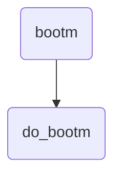
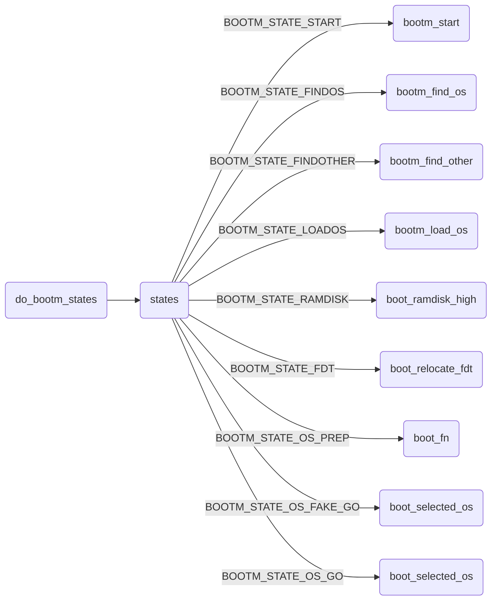
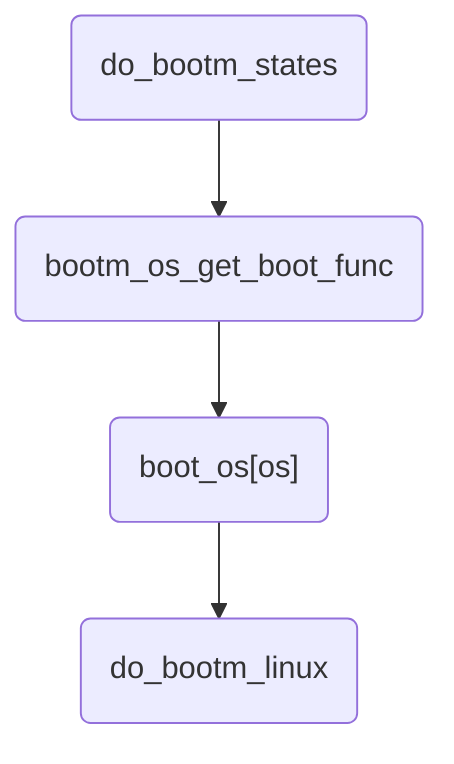
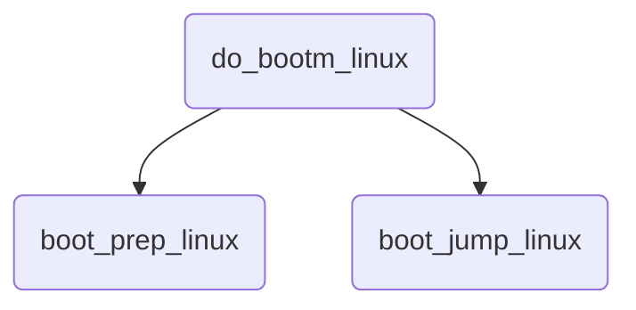

## u-boot引导kernel启动过程


u-boot引导Linux kernel启动的过程；


<!--more-->


### 目录

[TOC]


### bootm命令


bootm命令用于启动操作系统映像；bootm命令从映像文件的头部获取信息；包括：映像文件的CPU架构、操作系统类型、映像类型、压缩方式、映像文件在内存中的加载地址、映像文件运行的入口地址、映像文件名等；


bootm将映像文件加载到指定的地址，解压映像并传递必要的内核启动参数给内核，最后跳转到入口地址进入内核，开始执行内核；


bootm命令执行有三个步骤：


解压Linux内核映像并将其加载到RAM中


将ramdisk映像加载到RAM中


将控制权交给内核，并向内核传递ramdisk在RAM中的位置和大小等信息


将映像文件加载到RAM中时，需要确保映像文件的加载地址，不能与内核的位置有重叠；


```c
// cmd/bootm.c
U_BOOT_CMD(
    bootm,  CONFIG_SYS_MAXARGS, 1,  do_bootm,
    "boot application image from memory", bootm_help_text
);
```





```c
do_bootm
　　->do_bootm_states
　　　　->bootm_start /bootm_find_os /bootm_find_other
　　　　　　->bootm_load_os
　　　　　　->boot_fn = bootm_os_get_boot_func(images->os.os);
　　　　　　　　([IH_OS_LINUX] = do_bootm_linux,)　　
　　　　　　->boot_selected_os
　　　　　　　　->do_bootm_linux
　　　　　　　　　　->boot_prep_linux
　　　　　　　　　　　　->image_setup_linux
　　　　　　　　　　　　　　->boot_fdt_add_mem_rsv_regions
　　　　　　　　　　　　　　->boot_get_cmdline
　　　　　　　　　　　　　　->boot_relocate_fdt
　　　　　　　　　　　　　　->image_setup_libfdt
　　　　　　　　　　　　->boot_jump_linux
　　　　　　　　　　　　　　->r2 = (unsigned long)images->ft_addr;
　　　　　　　　　　　　　　->kernel_entry(0, machid, r2);
```


#### do_bootm


```c
// cmd/bootm.c
/*******************************************************************/
/* bootm - boot application image from image in memory */
/*******************************************************************/
int do_bootm(cmd_tbl_t *cmdtp, int flag, int argc, char * const argv[])
{
    /* determine if we have a sub command */
    argc--; argv++;
    if (argc > 0) {
        char *endp;

        simple_strtoul(argv[0], &endp, 16);
        /* endp pointing to NULL means that argv[0] was just a
         * valid number, pass it along to the normal bootm processing
         *
         * If endp is ':' or '#' assume a FIT identifier so pass
         * along for normal processing.
         *
         * Right now we assume the first arg should never be '-'
         */
        if ((*endp != 0) && (*endp != ':') && (*endp != '#'))
            return do_bootm_subcommand(cmdtp, flag, argc, argv);
    }

    return do_bootm_states(cmdtp, flag, argc, argv, BOOTM_STATE_START |
        BOOTM_STATE_FINDOS | BOOTM_STATE_FINDOTHER |
        BOOTM_STATE_LOADOS |
#ifdef CONFIG_SYS_BOOT_RAMDISK_HIGH
        BOOTM_STATE_RAMDISK |
#endif
        BOOTM_STATE_OS_PREP | BOOTM_STATE_OS_FAKE_GO |
        BOOTM_STATE_OS_GO, &images, 1);
}
```


bootm命令执行的核心操作由do_bootm_states()函数来完成；


do_bootm_states()函数操作，是由参数states来决定的；


```c
// include/image.h
#define BOOTM_STATE_START   (0x00000001)
#define BOOTM_STATE_FINDOS  (0x00000002)
#define BOOTM_STATE_FINDOTHER   (0x00000004)
#define BOOTM_STATE_LOADOS  (0x00000008)
#define BOOTM_STATE_RAMDISK (0x00000010)
#define BOOTM_STATE_FDT     (0x00000020)
#define BOOTM_STATE_OS_CMDLINE  (0x00000040)
#define BOOTM_STATE_OS_BD_T (0x00000080)
#define BOOTM_STATE_OS_PREP (0x00000100)
#define BOOTM_STATE_OS_FAKE_GO  (0x00000200)    /* 'Almost' run the OS */
#define BOOTM_STATE_OS_GO   (0x00000400)
```


do_bootm_states()函数的参数images，用来表示bootm命令启动kernel的一些信息，包含了指向os、initrd、fdt的映像信息；是全局变量：


```c
// common/bootm.c
bootm_headers_t images;     /* pointers to os/initrd/fdt images */
```


#### do_bootm_states


```c
// common/bootm.c
int do_bootm_states(cmd_tbl_t *cmdtp, int flag, int argc, char * const argv[],
            int states, bootm_headers_t *images, int boot_progress)
{
    boot_os_fn *boot_fn;
    ulong iflag = 0;
    int ret = 0, need_boot_fn;
    
    images->state |= states;

    if (states & BOOTM_STATE_START)
        ret = bootm_start(cmdtp, flag, argc, argv);

    if (!ret && (states & BOOTM_STATE_FINDOS))
        ret = bootm_find_os(cmdtp, flag, argc, argv);

    if (!ret && (states & BOOTM_STATE_FINDOTHER))
        ret = bootm_find_other(cmdtp, flag, argc, argv);

    /* Load the OS */
    if (!ret && (states & BOOTM_STATE_LOADOS)) {
        iflag = bootm_disable_interrupts();
        ret = bootm_load_os(images, 0);
		......
    }

    /* Relocate the ramdisk */
#ifdef CONFIG_SYS_BOOT_RAMDISK_HIGH
    if (!ret && (states & BOOTM_STATE_RAMDISK)) {
        ulong rd_len = images->rd_end - images->rd_start;

        ret = boot_ramdisk_high(&images->lmb, images->rd_start,
            rd_len, &images->initrd_start, &images->initrd_end);
		......
    }
#endif
#if IMAGE_ENABLE_OF_LIBFDT && defined(CONFIG_LMB)
    if (!ret && (states & BOOTM_STATE_FDT)) {
        boot_fdt_add_mem_rsv_regions(&images->lmb, images->ft_addr);
        ret = boot_relocate_fdt(&images->lmb, &images->ft_addr,
                    &images->ft_len);
    }
#endif
	......
    boot_fn = bootm_os_get_boot_func(images->os.os);
    ......
    if (!ret && (states & BOOTM_STATE_OS_PREP)) {
        ret = boot_fn(BOOTM_STATE_OS_PREP, argc, argv, images);
    }
    if (!ret && (states & BOOTM_STATE_OS_PREP)) {
        ret = boot_fn(BOOTM_STATE_OS_PREP, argc, argv, images);
    }

#ifdef CONFIG_TRACE
    /* Pretend to run the OS, then run a user command */
    if (!ret && (states & BOOTM_STATE_OS_FAKE_GO)) {
        char *cmd_list = env_get("fakegocmd");

        ret = boot_selected_os(argc, argv, BOOTM_STATE_OS_FAKE_GO,
                images, boot_fn);
        if (!ret && cmd_list)
            ret = run_command_list(cmd_list, -1, flag);
    }
#endif
	......
    /* Now run the OS! We hope this doesn't return */
    if (!ret && (states & BOOTM_STATE_OS_GO))
        ret = boot_selected_os(argc, argv, BOOTM_STATE_OS_GO,
                images, boot_fn);
	......
}
```





#### bootm_start


```c
// common/bootm.c
static int bootm_start(cmd_tbl_t *cmdtp, int flag, int argc,
               char * const argv[])
{
    memset((void *)&images, 0, sizeof(images));
    images.verify = env_get_yesno("verify");

    boot_start_lmb(&images);

    bootstage_mark_name(BOOTSTAGE_ID_BOOTM_START, "bootm_start");
    images.state = BOOTM_STATE_START;

    return 0;
}
```


#### bootm_find_os


```c
static int bootm_find_os(cmd_tbl_t *cmdtp, int flag, int argc,
             char * const argv[])
{
    const void *os_hdr;
    bool ep_found = false;
    int ret;

    /* get kernel image header, start address and length */
    os_hdr = boot_get_kernel(cmdtp, flag, argc, argv,
            &images, &images.os.image_start, &images.os.image_len);
    if (images.os.image_len == 0) {
        puts("ERROR: can't get kernel image!\n");
        return 1;
    }   

    /* get image parameters */
    switch (genimg_get_format(os_hdr)) {
#if CONFIG_IS_ENABLED(LEGACY_IMAGE_FORMAT)
    case IMAGE_FORMAT_LEGACY:
        images.os.type = image_get_type(os_hdr);
        images.os.comp = image_get_comp(os_hdr);
        images.os.os = image_get_os(os_hdr);

        images.os.end = image_get_image_end(os_hdr);
        images.os.load = image_get_load(os_hdr);
        images.os.arch = image_get_arch(os_hdr);
        break;
#endif
    ......
	} else if (images.legacy_hdr_valid) {
        images.ep = image_get_ep(&images.legacy_hdr_os_copy);
    }
	......
    images.os.start = map_to_sysmem(os_hdr);

    return 0;
}
```


##### boot_get_kernel

boot_get_kernel()函数，获取内核映像的头、起始地址、长度；


```c
// common/bootm_os.c
boot_os_fn *bootm_os_get_boot_func(int os)
{
#ifdef CONFIG_NEEDS_MANUAL_RELOC
    static bool relocated;

    if (!relocated) {
        int i;

        /* relocate boot function table */
        for (i = 0; i < ARRAY_SIZE(boot_os); i++)
            if (boot_os[i] != NULL)
                boot_os[i] += gd->reloc_off;

        relocated = true;
    }
#endif
    return boot_os[os];
}
```


```c
// common/bootm_os.c
static boot_os_fn *boot_os[] = {
    [IH_OS_U_BOOT] = do_bootm_standalone,
#ifdef CONFIG_BOOTM_LINUX
    [IH_OS_LINUX] = do_bootm_linux,
#endif
......
};
```


u-boot中支持bootm命令需要打开CONFIG_BOOTM_LINUX和CONFIG_CMD_BOOTM配置，即：


```
CONFIG_BOOTM_LINUX=y
```





#### image


bootm_headers_t结构是用来表示bootm命令启动kernel的一些信息的结构体，包含了指向os、initrd、fdt的映像信息；


```c
// common/bootm.c
bootm_headers_t images;     /* pointers to os/initrd/fdt images */
```


bootm命令中，会根据参数以及参数指向的映像来填充bootm_headers_t结构体中的成员；最后再使用这个结构体中的信息填充kernel启动信息，并跳转到kernel执行；


```c
// include/image.h
/*
 * Legacy and FIT format headers used by do_bootm() and do_bootm_<os>()
 * routines.
 */
typedef struct bootm_headers {
    /*
     * Legacy os image header, if it is a multi component image
     * then boot_get_ramdisk() and get_fdt() will attempt to get
     * data from second and third component accordingly.
     */
    image_header_t  *legacy_hdr_os;     /* image header pointer */
    image_header_t  legacy_hdr_os_copy; /* header copy */
    ulong       legacy_hdr_valid;

#if IMAGE_ENABLE_FIT
    const char  *fit_uname_cfg; /* configuration node unit name */

    void        *fit_hdr_os;    /* os FIT image header */
    const char  *fit_uname_os;  /* os subimage node unit name */
    int     fit_noffset_os; /* os subimage node offset */

    void        *fit_hdr_rd;    /* init ramdisk FIT image header */
    const char  *fit_uname_rd;  /* init ramdisk subimage node unit name */
    int     fit_noffset_rd; /* init ramdisk subimage node offset */

    void        *fit_hdr_fdt;   /* FDT blob FIT image header */
    const char  *fit_uname_fdt; /* FDT blob subimage node unit name */
    int     fit_noffset_fdt;/* FDT blob subimage node offset */

    void        *fit_hdr_setup; /* x86 setup FIT image header */
    const char  *fit_uname_setup; /* x86 setup subimage node name */
    int     fit_noffset_setup;/* x86 setup subimage node offset */
#endif

#ifndef USE_HOSTCC
    image_info_t    os;     /* os image info */
    ulong       ep;     /* entry point of OS */

    ulong       rd_start, rd_end;/* ramdisk start/end */

    char        *ft_addr;   /* flat dev tree address */
    ulong       ft_len;     /* length of flat device tree */

    ulong       initrd_start;
    ulong       initrd_end;
    ulong       cmdline_start;
    ulong       cmdline_end;
    bd_t        *kbd;
#endif

    int     verify;     /* env_get("verify")[0] != 'n' */

#define BOOTM_STATE_START   (0x00000001)
#define BOOTM_STATE_FINDOS  (0x00000002)
#define BOOTM_STATE_FINDOTHER   (0x00000004)
#define BOOTM_STATE_LOADOS  (0x00000008)
#define BOOTM_STATE_RAMDISK (0x00000010)
#define BOOTM_STATE_FDT     (0x00000020)
#define BOOTM_STATE_OS_CMDLINE  (0x00000040)
#define BOOTM_STATE_OS_BD_T (0x00000080)
#define BOOTM_STATE_OS_PREP (0x00000100)
#define BOOTM_STATE_OS_FAKE_GO  (0x00000200)    /* 'Almost' run the OS */
#define BOOTM_STATE_OS_GO   (0x00000400)
    int     state;

#ifdef CONFIG_LMB
    struct lmb  lmb;        /* for memory mgmt */
#endif
} bootm_headers_t;
```


#### do_bootm_linux


为了能够正常调用do_bootm_linux函数，需要打开CONFIG_CMD_BOOTM配置；


```
CONFIG_CMD_BOOTM=y
```


因为do_bootm_linux函数是平台相关的函数，需要在arm平台下打开对应的CONFIG_CMD_BOOTM配置；


```
arch/arm/lib/Makefile:34:obj-$(CONFIG_CMD_BOOTM) += bootm.o
```





do_bootm_linux()函数是bootm实现的主要入口点


```c
// arch/arm/lib/bootm.c
int do_bootm_linux(int flag, int argc, char * const argv[],
           bootm_headers_t *images)
{
    if (flag & BOOTM_STATE_OS_PREP) {
        boot_prep_linux(images);
        return 0;
    }

    if (flag & (BOOTM_STATE_OS_GO | BOOTM_STATE_OS_FAKE_GO)) {
        boot_jump_linux(images, flag);
        return 0;
    }

    boot_prep_linux(images);
    boot_jump_linux(images, flag);
    return 0;
}
```


### u-boot给Kernel传参


嵌入式环境的Linux内核运行需要通过u-boot来加载并启动运行，在内核启动之前，由u-boot来提供Kernel的运行环境，同时将启动需要的参数传递给Kernel；


**传参方法**：将要传递的参数，封装成一个结构体，把这个结构体连续存储在内存的一片区域，将内存区域的物理地址传递给内核，内核在启动时从指定的物理地址中读取参数，并通过parse_tags()来解析参数，就完成了给kernel传参；


u-boot中定义这个结构体为tag：


```c
// arch/arm/include/asm/setup.h
struct tag {
    struct tag_header hdr;
    union {
        struct tag_core     core;
        struct tag_mem32    mem;
        struct tag_videotext    videotext;
        struct tag_ramdisk  ramdisk;
        struct tag_initrd   initrd;
        struct tag_serialnr serialnr;
        struct tag_revision revision;
        struct tag_videolfb videolfb;
        struct tag_cmdline  cmdline;
        struct tag_acorn    acorn;
        struct tag_memclk   memclk;
    } u;
};
```


这个数据结构在u-boot和kernel中都有定义，并且必须保持一致；


其中tag_header为tag头，表明tag的类型和大小，类型是用来区别tag之间不同的处理函数；


```c
// arch/arm/include/asm/setup.h
struct tag_header {
    u32 size;
    u32 tag;
};
```


这个链表必须以tag_header.tag = ATAG_CORE开始，以tag_header.tag = ATAG_NONE结束；


#### 应用


```c
// arch/arm/lib/bootm.c
static void boot_prep_linux(bootm_headers_t *images)
{
    char *commandline = env_get("bootargs");

    if (IMAGE_ENABLE_OF_LIBFDT && images->ft_len) {
#ifdef CONFIG_OF_LIBFDT
        debug("using: FDT\n");
        if (image_setup_linux(images)) {
            printf("FDT creation failed! hanging...");
            hang();
        }
#endif
    } else if (BOOTM_ENABLE_TAGS) {
        debug("using: ATAGS\n");
        setup_start_tag(gd->bd);
        if (BOOTM_ENABLE_SERIAL_TAG)
            setup_serial_tag(&params);
        if (BOOTM_ENABLE_CMDLINE_TAG)
            setup_commandline_tag(gd->bd, commandline);
        if (BOOTM_ENABLE_REVISION_TAG)
            setup_revision_tag(&params);
        if (BOOTM_ENABLE_MEMORY_TAGS)
            setup_memory_tags(gd->bd);
        if (BOOTM_ENABLE_INITRD_TAG) {
            if (images->initrd_start && images->initrd_end) {
                setup_initrd_tag(gd->bd, images->initrd_start,
                         images->initrd_end);
            } else if (images->rd_start && images->rd_end) {
                setup_initrd_tag(gd->bd, images->rd_start,
                         images->rd_end);
            }
        }
        setup_board_tags(&params);
        setup_end_tag(gd->bd);
    } else {
        printf("FDT and ATAGS support not compiled in - hanging\n");
        hang();
    }
}
```


