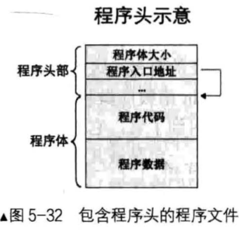

## linux中ELF二进制程序解析


### 目录


[TOC]


### 0. 简介


在Linux系统的可执行文件（ELF文件）中，开头是一个文件头，用来描述程序的布局，整个文件的属性等信息，包括文件是否可执行、静态还是动态链接及入口地址等信息；如下图所示：





程序文件中包含了程序头，程序的入口地址等信息不需要写死，调用代码可以通用，根据实际情况加载；此时的文件不是纯碎的二进制可执行文件了，因为包含的程序头不是可执行代码；将这种包含程序头的文件读入到内存后，从程序头中读取入口地址，跳转到入口地址执行；


#### 0.1 文件格式


Linux环境中，目标文件是源代码编译后未链接的中间文件，如：gcc编译生成的.o文件；可执行文件（.o）、动态链接库（.so）、静态链接库（.a）文件都是按照ELF可执行文件格式存储的；


ELF指：Executable and Linkable Format，可执行链接格式；本文中的目标文件指各种类型符合ELF规范的我呢见，如：二进制可执行文件、Linux下的.o目标文件和.so动态库文件；


可执行文件（Executable file）：经过编译链接后，可以直接执行的程序文件，如：ELF文件；


共享目标文件（Shared object file）：动态链接库，在可执行文件被加载的过程中动态链接，成为程序代码的一部分；


可重定位文件（Relocatable file）：可重定位文件即目标文件和静态库文件，是源文件编译后但未完成链接的半成品，被用于与其他目标文件合并链接，以构建出二进制可执行文件；


核心转储文件（Core dump file）：当进程意外终止时，系统可以将该进程的地址空间的内容及终止时的一些信息转储到核心转储文件；


#### 0.2 段和节


程序中的段（Segment）和节（Secton）是真正的程序体；段包括代码段和数据段等，段是由节组成的，多个节经过链接后被合并为一个段；


段和节的信息用header描述，程序头是program header，节头是section header；段和节的大小和数量都是不固定的，需要用专门的数据结构来描述，即程序头表（program header table）和节头表（section header table），这是两个数组，元素分别是程序头（program header）和节头（section header）；程序头表（program header table）中的元素全是程序头（program header），节头表（section header table）中的元素全是节头（section header）；程序头表是用来描述段（Segment）的，成为段头表；段是程序本身的组成部分；


由于段和节的大小和数量都是不固定的，程序头表和节头表的大小也不固定，两个表在程序文件中的位置也不固定；需要在一个固定的位置，用一个固定大小的数据结构来描述程序头表和节头表的大小和位置信息，即位于文件最开始部分的ELF header；


### 1. ELF header


ELF目标文件的最开始是ELF文件头（ELF Header），包含了描述整个文件的基本属性；ELF文件分为文件头和文件体两部分；先用ELF header从文件全局概要出程序中程序头表、节头表的位置和大小等信息；然后从程序头表和节头表中分别解析出各个段和节的位置和大小等信息；


可执行文件和待重定位文件，文件最开头的部分是ELF header；程序头表对于可执行文件是必须的，而对于待重定位文件是可选的；


ELF文件头在32位系统中用Elf32_Ehdr结构体表示，在64位系统中用Elf64_Ehdr结构体表示；两者内容是一样的，区别是有些成员的大小不同；


```c
// include/uapi/linux/elf.h
#define EI_NIDENT   16

typedef struct elf32_hdr{
  unsigned char e_ident[EI_NIDENT];
  Elf32_Half    e_type;
  Elf32_Half    e_machine;
  Elf32_Word    e_version;
  Elf32_Addr    e_entry;  /* Entry point */
  Elf32_Off e_phoff;
  Elf32_Off e_shoff;
  Elf32_Word    e_flags;
  Elf32_Half    e_ehsize;
  Elf32_Half    e_phentsize;
  Elf32_Half    e_phnum;
  Elf32_Half    e_shentsize;
  Elf32_Half    e_shnum;
  Elf32_Half    e_shstrndx;
} Elf32_Ehdr;

typedef struct elf64_hdr {
  unsigned char e_ident[EI_NIDENT]; /* ELF "magic number" */
  Elf64_Half e_type;
  Elf64_Half e_machine;
  Elf64_Word e_version;
  Elf64_Addr e_entry;       /* Entry point virtual address */
  Elf64_Off e_phoff;        /* Program header table file offset */
  Elf64_Off e_shoff;        /* Section header table file offset */
  Elf64_Word e_flags;
  Elf64_Half e_ehsize;
  Elf64_Half e_phentsize;
  Elf64_Half e_phnum;
  Elf64_Half e_shentsize;
  Elf64_Half e_shnum;
  Elf64_Half e_shstrndx;
} Elf64_Ehdr;
```


| 成员        | 大小（32位） | 大小（64位） | 说明                                                         |

| ----------- | ------------ | ------------ | ------------------------------------------------------------ |

| e_ident     | 16           | 16           | 表示ELF字符等信息，开头四个字节是固定不变的elf文件魔数，0x7f 0x45 0x4c 0x46；可用于确认文件类型是否正确； |

| e_type      | 2            | 2            | ELF目标文件的类型；                                          |

| e_machine   | 2            | 2            | ELF目标文件的体系结构类型，即要在哪种硬件平台运行；          |

| e_version   | 4            | 4            | 版本信息；                                                   |

| e_entry     | 4            | 8            | 操作系统运行该程序时，将控制权转交到的虚拟地址；             |

| e_phoff     | 4            | 8            | 程序头表（program header table）在文件内的字节偏移量；如果没有程序头表，该值为0； |

| e_shoff     | 4            | 8            | 节头表（section header table）在文件内的字节偏移量；如果没有节头表，该值为0 |

| e_flags     | 4            | 4            | 与处理器相关的标志；                                         |

| e_ehsize    | 2            | 2            | ELF header的大小；                                           |

| e_phentsize | 2            | 2            | 程序头表（program header table）中每个条目（entry）的大小，即每个用来描述段信息的数据结构的大小；struct Elf32_Phdr； |

| e_phnum     | 2            | 2            | 程序头表中条目的数量，即段的个数；                           |

| e_shentsize | 2            | 2            | 节头表（section header table）中每个条目（entry）的大小，即每个用来描述节信息的数据结构的大小； |

| e_shnum     | 2            | 2            | 节头表中条目的数量，即节的个数；                             |

| e_shstrndx  | 2            | 2            | string name table在节头表中的索引index；                     |


e_ident[EI_NIDENT]是16字节大小的数组，用来表示ELF字符等信息，开头四个字节是固定不变的elf文件魔数，0x7f 0x45 0x4c 0x46；


| e_ident数组               | 说明                                                         |

| ------------------------- | ------------------------------------------------------------ |

| e_ident[0~3] = 0x7f E L F | 固定的ELF文件魔数，用于识别ELF文件                           |

| e_ident[4]                | 表示ELF文件的类型，0：不可识别类型，1：32位elf格式文件，2：64位elf格式文件 |

| e_ident[5]                | 指定编码格式，字节序是大端还是小端，0：非法编码格式，1：小端LSB，2：大端MSB |

| e_ident[6]                | ELF头的版本信息，默认为1，0：非法版本，1：当前版本           |

| e_ident[7~15]             | 保留，置为0                                                  |


e_type：2字节，用来指定ELF目标文件的类型；


```c
// include/uapi/linux/elf.h
/* These constants define the different elf file types */
#define ET_NONE   0		// 未知目标文件格式
#define ET_REL    1		// 可重定位文件
#define ET_EXEC   2		// 可执行文件
#define ET_DYN    3		// 动态共享目标文件
#define ET_CORE   4		// core文件，程序崩溃时内存映像的转储格式
#define ET_LOPROC 0xff00	// 特定处理器文件的扩展下界
#define ET_HIPROC 0xffff	// 特定处理器文件的扩展上界
```


e_machine：2字节，用来描述ELF目标文件的体系结构类型，即要在哪种硬件平台运行；


```c
// include/uapi/linux/elf-em.h
/* These constants define the various ELF target machines */
#define EM_NONE     0
#define EM_M32      1
#define EM_SPARC    2
#define EM_386      3
#define EM_68K      4
#define EM_88K      5
#define EM_486      6   /* Perhaps disused */
#define EM_860      7
#define EM_MIPS     8   /* MIPS R3000 (officially, big-endian only) */
                /* Next two are historical and binaries and
                   modules of these types will be rejected by
                   Linux.  */
#define EM_MIPS_RS3_LE  10  /* MIPS R3000 little-endian */
#define EM_MIPS_RS4_BE  10  /* MIPS R4000 big-endian */

#define EM_PARISC   15  /* HPPA */
#define EM_SPARC32PLUS  18  /* Sun's "v8plus" */
#define EM_PPC      20  /* PowerPC */
......
```


### 2. 程序头表


程序头表（也称为段表）是一个描述文件中各个段的数组，程序头表描述了文件中各个段在文件中的偏移位置及段的属性等信息；从程序头表里可以得到每个段的所有信息，包括代码段和数据段等；各个段的内容紧跟ELF文件头保存；程序头表中各个段用Elf32_Phdr或Elf64_Phdr结构体表示；


```c
// include/uapi/linux/elf.h
typedef struct elf32_phdr{
  Elf32_Word    p_type;
  Elf32_Off p_offset;
  Elf32_Addr    p_vaddr;
  Elf32_Addr    p_paddr;
  Elf32_Word    p_filesz;
  Elf32_Word    p_memsz;
  Elf32_Word    p_flags;
  Elf32_Word    p_align;
} Elf32_Phdr;

typedef struct elf64_phdr {
  Elf64_Word p_type;
  Elf64_Word p_flags;
  Elf64_Off p_offset;       /* Segment file offset */
  Elf64_Addr p_vaddr;       /* Segment virtual address */
  Elf64_Addr p_paddr;       /* Segment physical address */
  Elf64_Xword p_filesz;     /* Segment size in file */
  Elf64_Xword p_memsz;      /* Segment size in memory */
  Elf64_Xword p_align;      /* Segment alignment, file & memory */
} Elf64_Phdr;
```


Elf32_Phdr或Elf64_Phdr结构体用来描述位于磁盘上的程序中的一个段；


| 成员     | 大小（32位） | 大小（64位） | 说明                                                         |

| -------- | ------------ | ------------ | ------------------------------------------------------------ |

| p_type   | 4            | 4            | 程序中该段的类型；                                           |

| p_offset | 4            | 8            | 本段在文件内的起始偏移；                                     |

| p_vaddr  | 4            | 8            | 本段在内存中的起始虚拟地址；                                 |

| p_paddr  | 4            | 8            | 用于与物理地址相关的系统中；                                 |

| p_filesz | 4            | 8            | 本段在文件中的大小；                                         |

| p_memsz  | 4            | 8            | 本段在内存中的大小；                                         |

| p_flags  | 4            | 4            | 与本段相关的标志；                                           |

| p_align  | 4            | 8            | 本段在文件和内存中的对齐方式；如果为0或1，表示不对齐，否则应该为2的幂次数； |


p_type：4字节，用来指明程序中该段的类型；


```c
// include/uapi/linux/elf.h
/* These constants are for the segment types stored in the image headers */
#define PT_NULL    0 // 忽略 
#define PT_LOAD    1 // 可加载程序段
#define PT_DYNAMIC 2 // 动态链接信息
#define PT_INTERP  3 // 动态加载器名称
#define PT_NOTE    4 // 辅助的附加信息 
#define PT_SHLIB   5 // 保留
#define PT_PHDR    6 // 程序头表
#define PT_TLS     7               /* Thread local storage segment */
#define PT_LOOS    0x60000000      /* OS-specific */
#define PT_HIOS    0x6fffffff      /* OS-specific */
#define PT_LOPROC  0x70000000
#define PT_HIPROC  0x7fffffff
```


p_flags：4字节，用来指明与本段相关的标志；


```c
// include/uapi/linux/elf.h
/* These constants define the permissions on sections in the program    header, p_flags. */
#define PF_R        0x4  // 可读
#define PF_W        0x2  // 可写
#define PF_X        0x1  // 可执行
```


### 3. 节头表


节头表中各个节用Elf32_Shdr或Elf64_Shdr结构体表示；


```c
// include/uapi/linux/elf.h
typedef struct elf32_shdr {
  Elf32_Word    sh_name;
  Elf32_Word    sh_type;
  Elf32_Word    sh_flags;
  Elf32_Addr    sh_addr;
  Elf32_Off sh_offset;
  Elf32_Word    sh_size;
  Elf32_Word    sh_link;
  Elf32_Word    sh_info;
  Elf32_Word    sh_addralign;
  Elf32_Word    sh_entsize;
} Elf32_Shdr;

typedef struct elf64_shdr {
  Elf64_Word sh_name;       /* Section name, index in string tbl */
  Elf64_Word sh_type;       /* Type of section */
  Elf64_Xword sh_flags;     /* Miscellaneous section attributes */
  Elf64_Addr sh_addr;       /* Section virtual addr at execution */
  Elf64_Off sh_offset;      /* Section file offset */
  Elf64_Xword sh_size;      /* Size of section in bytes */
  Elf64_Word sh_link;       /* Index of another section */
  Elf64_Word sh_info;       /* Additional section information */
  Elf64_Xword sh_addralign; /* Section alignment */
  Elf64_Xword sh_entsize;   /* Entry size if section holds table */
} Elf64_Shdr;
```


Elf32_Shdr或Elf64_Shdr结构体用来描述位于磁盘上的程序中的一个节；


成员32位64位说明sh_name44节名称，值是字符串的一个索引；节名称字符串以'\0'结尾，统一存储在字符串表中，使用该字段存储节名称字符串在字符串表中的索引位置；sh_type44节的类型；sh_flags48节的标志；sh_addr48节在内存中的起始地址，指定节映射到虚拟地址空间中的位置；sh_offset48节在文件中的起始位置；sh_size48节的大小；sh_link44引用另一个节头表项，根据节类型有不同的解释；sh_info44节的附加信息，与sh_link联合使用；sh_addralign48节数据在内存中的对齐方式；sh_entsize48指定节中各数据项的长度，各数据项长度要相同；


| 成员         | 大小（32位） | 大小（64位） | 说明                                                         |

| ------------ | ------------ | ------------ | ------------------------------------------------------------ |

| sh_name      | 4            | 4            | 节名称，值是字符串的一个索引；节名称字符串以'\0'结尾，统一存储在字符串表中，使用该字段存储节名称字符串在字符串表中的索引位置； |

| sh_type      | 4            | 4            | 节的类型；                                                   |

| sh_flags     | 4            | 8            | 节的标志；                                                   |

| sh_addr      | 4            | 8            | 节在内存中的起始地址，指定节映射到虚拟地址空间中的位置；     |

| sh_offset    | 4            | 8            | 节在文件中的起始位置；                                       |

| sh_size      | 4            | 8            | 节的大小；                                                   |

| sh_link      | 4            | 4            | 引用另一个节头表项，根据节类型有不同的解释；                 |

| sh_info      | 4            | 4            | 节的附加信息，与sh_link联合使用；                            |

| sh_addralign | 4            | 8            | 节数据在内存中的对齐方式；sh_entsize48指定节中各数据项的长度，各数据项长度要相同； |


sh_name


节名称sh_name的值是字符串的一个索引，节名称字符串以'\0'结尾，字符串统一存放在字符串表中，使用sh_name的值作为字符串表的索引，找到对应的字符串即为节名称；


字符串表中包含多个以'\0'结尾的字符串；在目标文件中，这些字符串通常是符号的名字或节的名字，需要引用某些字符串时，只需要提供该字符串在字符串表中的序号即可；


字符串表中的第一个字符串（序号为0）是空串，即'\0'，可以用于表示没有名字或一个空的名字；如果字符串表为空，节头中的sh_size值为0；


sh_type：节的类型；


```c
// include/uapi/linux/elf.h
/* sh_type */
#define SHT_NULL    0 // 表示该节是无效节头，没有对应的节
#define SHT_PROGBITS    1
#define SHT_SYMTAB  2
#define SHT_STRTAB  3
#define SHT_RELA    4
#define SHT_HASH    5
#define SHT_DYNAMIC 6
#define SHT_NOTE    7
#define SHT_NOBITS  8
#define SHT_REL     9
#define SHT_SHLIB   10
#define SHT_DYNSYM  11
#define SHT_NUM     12
#define SHT_LOPROC  0x70000000
#define SHT_HIPROC  0x7fffffff
#define SHT_LOUSER  0x80000000
#define SHT_HIUSER  0xffffffff
```


sh_flags：节的标志；


```c
// include/uapi/linux/elf.h
/* sh_flags */
#define SHF_WRITE   0x1  // 可写
#define SHF_ALLOC   0x2  // 该节包含内存在进程运行时需要占用内存单元
#define SHF_EXECINSTR   0x4 // 该节内容是指令代码
#define SHF_MASKPROC    0xf0000000
```


### 4. readelf命令


readelf命令用于查看ELF格式的文件信息；


```c
$ readelf -H
Usage: readelf <option(s)> elf-file(s)
 Display information about the contents of ELF format files
 Options are:
  -a --all               Equivalent to: -h -l -S -s -r -d -V -A -I
  -h --file-header       Display the ELF file header
  -l --program-headers   Display the program headers
     --segments          An alias for --program-headers
  -S --section-headers   Display the sections' header
     --sections          An alias for --section-headers
  -e --headers           Equivalent to: -h -l -S
  ......
```


命令如下：


```c
$ readelf -h file // 显示ELF文件头
$ readelf -l file // 显示所有的程序头
$ readelf -S file // 显示所有的节头
$ readelf -e file // 显示ELF文件头、程序头、节头全部的头信息，相当于同时运行参数-h、-l、-S
```


### 5. xxd命令


由于ELF文件是二进制文件，和普通文件不同，不能使用一般的vim等编辑工具直接打开；而xxd命令主要用来查看文件的十六进制格式，同样也能够以二进制格式查看文件；


```c
$ man xxd
NAME
       xxd - make a hexdump or do the reverse.

SYNOPSIS
       xxd -h[elp]
       xxd [options] [infile [outfile]]
......
```


xxd命令常用的选项：


```c
-a: 自动跳过空白内容，默认关闭；
-u: 使用大写字符的十六进制，默认小写；
-c: 后边加上数字，表示每行显示多少字节的十六进制数，默认16字节，最大256字节；
-g: 设定以多少个字节为一块，默认2字节；
-l: 显示多少字节内容；
-b: 表示以二进制的形式查看文件内容；
-s: 后面接[+-]和address，+表示从address处开始的内容，-表示从距末尾address处开始的内容；
```


### 6. 总结


在Linux系统的可执行文件（ELF文件）中，开头是一个文件头，用来描述程序的布局，整个文件的属性等信息，包括文件是否可执行、静态还是动态链接及入口地址等信息；生成的文件不是纯碎的二进制可执行文件了，因为包含的程序头不是可执行代码；将这种包含程序头的文件读入到内存后，从程序头中读取入口地址，跳转到入口地址执行；


### 参考资料


《操作系统真象还原》


程序编译-汇编-链接的理解！—03-ELF头和节头表


ELF文件-节和节头


[回到目录](#目录)