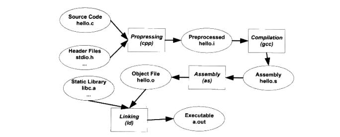

## linux程序编译过程简析


### 目录


[TOC]


### 简介


Linux环境下，平时进行应用程序的编译操作时，一般都是直接使用gcc编译生成可执行文件，很少关注gcc编译的具体实现过程；虽然平时不需要关注编译过程，但是在出现一些问题的时候，我们需要逐步去分析哪里出现问题，学习编译过程可以有助于问题的分析和解决；


Linux应用程序的编译过程，包含了四个过程：预处理(Prepressing)、编译(Compilation)、汇编(Assembly)、链接(Linking)；这四个过程在使用时，被gcc命令给隐藏起来了；


### 编译过程


这里我们以C语言为基础，使用软件界经典的入门程序Hello world，来验证和学习编译的四大步骤；


```c
// cat hello.c
#include <stdio.h>

int main(void)
{
    printf("Hello world!\n");
    
    return 0;
}
```


Linux系统中，使用gcc来编译C语言程序很容易；


```c
$ gcc hello.c
$ ./a.out
```


以上的编译过程，是由四个步骤合并而成，这四个步骤分别是预处理、编译、汇编、链接；





#### 1. 预处理


编译的第一步是预处理，预处理将源代码文件hello.c和包含的头文件stdio.h，使用预编译器cpp（此处的cpp不是C++编译器）预编译成.i文件；相当于如下命令操作：


```c
$ gcc -E hello.c -o hello.i
```


或


```c
$ cpp hello.c > hello.i
```


预编译过程主要处理源代码中以”#“开始的预编译指令，如：头文件“#include”、宏定义“#define”、条件编译“#if”等；主要规则如下：


将所有的“#define”删除，并且展开所有的宏定义；


处理所有条件预编译指令，如：#if、#ifdef、#ifndef、#elif、#else、#endif等；


处理“#include”预编译指令，递归地将被包含文件插入到该预编译指令所在的位置；


删除所有的注释；


添加行号和文件名标识，以便于编译时编译器产生调试用的行号信息和编译时产生编译错误或警告的行号；


保留所有的#pragma编译器指令，编译器要使用；


经过预编译后的.i文件不包含任何宏定义，所有的宏和文件已经被插入到.i文件中，可以通过查看预编译后的文件来确定宏定义是否正确或头文件是否包含；


#### 2. 编译


编译器将高级语言翻译成机器语言，编译器的工作过程一般分为六步：扫描、语法分析、语义分析、源代码优化、代码生成、目标代码优化；最终完成从源代码到最终目标代码的过程；


编译过程把预处理完的文件按照编译过程的六步操作后，生成相应的汇编代码文件，这部分是程序构建最复杂、最核心的部分，作者能力有限，此处不再进行描述；简要介绍命令操作如下：


```c
$ gcc -S hello.i -o hello.s
```


或使用cc1工具，cc1工具将预编译和编译合并在一起；


```c
$ cc1 hello.c > hello.s
```


或者从C语言直接编译为汇编代码文件：


```c
$ gcc -S hello.c -o hello.s
```


现在版本的gcc把预编译和编译两个步骤合并为一个步骤，使用cc1程序来完成编译操作；


#### 3. 汇编


汇编是由汇编器as来完成的，汇编器是将汇编代码转变成机器可以执行的指令，几乎每一条汇编语句都对应一条机器指令；汇编过程没有复杂的语法、语义，也不需要指令优化，只是根据汇编指令和机器指令的对照表翻译；汇编命令如下操作：


```c
$ as hello.s -o hello.o
```


或


```c
$ gcc -c hello.s -o hello.o
```


或者直接从C语言经过预编译、编译、汇编，输出目标文件：


```c
$ gcc -c hello.c -o hello.o
```


#### 4. 链接


链接由链接器ld来完成；链接器将由不同源代码生成的目标文件，和库文件进行链接才能生成最终的可执行程序文件；链接过程比较复杂，链接的简化命令如下所示


```c
$ ld *.o -o a.out
```


经过链接之后生成的目标文件，是最终的可执行文件；


链接由两种方法，静态链接和动态链接；两者最大的区别是链接的时机不一样，静态链接是在生成可执行程序前链接；动态链接是在程序执行时；关于链接部分内容可以参考另外一篇文章《静态链接和动态链接》；


Linux下进行链接的缺省操作是，首先链接使用动态库；即如果同时存在静态和动态库文件，不特别指定时，将与动态库链接；


gcc命令是四个步骤的包装，会根据不同的参数要求去调用预编译程序cc1、汇编器as、链接器ld，经过四个步骤的操作后，最终编译生成ELF格式的二进制文件；关于ELF二进制文件的解析，可以参考《[linux中ELF二进制文件解析](https://www.toutiao.com/i6871854586903134724/?group_id=6871854586903134724)》；


### 总结


Linux环境中的编译过程，分为预处理、编译、汇编、链接四个步骤，每个步骤都有相对应的工具操作完成；gcc命令是由四个步骤包装得到，gcc命令会根据不同的参数要求调用预编译程序cc1、汇编器as、链接器ld，最终生成可执行文件；


### 参考资料


《程序员的自我修养----链接、装载与库》


[回到目录](#目录)