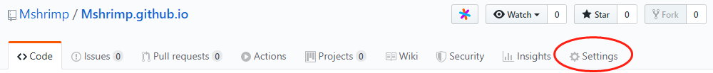
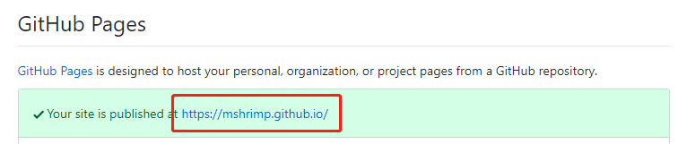
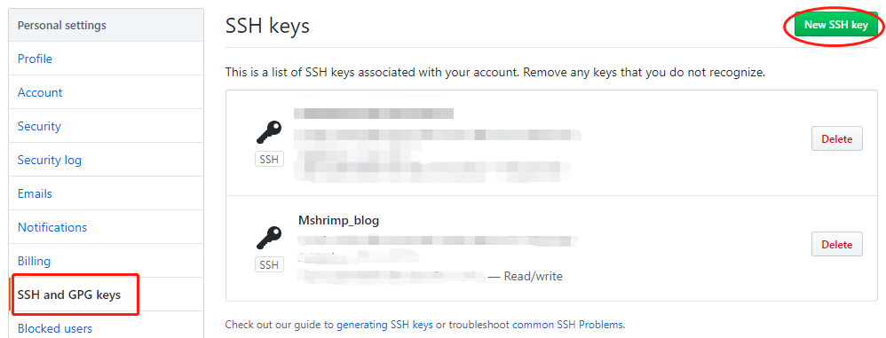

### 1. 简介

首次通过Hexo和Github搭建自己的博客，尝试成功，从别人那里借来个yilia主题，看着挺漂亮，索性直接当我的主题用了，虽然还不会太多的配置操作，先把自己搭建博客过程中的主要操作记录下来。

<!--more-->

#### 环境简介

本地电脑环境：

> windows10


搭建博客需要安装的软件：

> git
> node.js
> hexo

安装搭建博客需要的工具：git和node.js；通过一下命令查询：

```shell
# git --version
git version 2.22.0.windows.1
```

```shell
# node -v
v10.16.0
```

```shell
# npm config set registry https://registry.npm.taobao.org
```


默认已经注册有Github帐号；

Hexo软件还未安装，下文会简单讲述Hexo软件的安装；


### 2. Github仓库创建和配置

#### 2.1 创建Git仓库

打开GitHub，点击“New repository”，创建一个新仓库，用来专门存放博客日志信息；仓库名要按照格式：账户名.github.io，比如：Mshrimp.github.io；否则，后边的操作会出现问题；创建仓库时勾选上“
Initialize this repository with a README”；

进入创建好的仓库Mshrimp.github.io，点击右侧的“Settings”，向下拉找到Github Pages，会看到网站是：https://mshrimp.github.io/，点击就可以访问，也可以通过外网访问，这时这个博客项目已经部署到网站上了，但是是个空的网站，没有内容；这个网址是博客的默认地址，如果有兴趣可以自己购买域名换成想要的地址。





#### 2.2 配置git仓库

如果是第一次使用git，就需要先配置git环境，否则可以跳过；
```shell
# git config --global user.name "Mshrimp"
# git config --global user.email "******@outlook.com"
```

在没有配置git环境之前，~/.ssh是不存在的
```shell
# cd ~/.ssh
bash: cd: /c/Users/Kevin-TP/.ssh: No such file or directory
```

使用ssh-keygen生成私钥和公钥
```shell
# ssh-keygen -t rsa -C "chiyuan.ma@outlook.com"
Generating public/private rsa key pair.
Enter file in which to save the key (/c/Users/Kevin-TP/.ssh/id_rsa):
Created directory '/c/Users/Kevin-TP/.ssh'.
Enter passphrase (empty for no passphrase):
Enter same passphrase again:
Your identification has been saved in /c/Users/Kevin-TP/.ssh/id_rsa.
Your public key has been saved in /c/Users/Kevin-TP/.ssh/id_rsa.pub.
The key fingerprint is:
SHA256:pHNkvs9RsOToxmFH6gnkOb7j/dlRSc4c6TkOvGQ6fcc chiyuan.ma@outlook.com
The key's randomart image is:
+---[RSA 3072]----+
|                 |
|               . |
|      . + +   +  |
|     o B * + * + |
|      B S + * X  |
|     . X = * = o |
|      . B + + o E|
|      .+ o = o . |
|     .o...= .    |
+----[SHA256]-----+
```
从以上的操作打印可以知道，生成的密钥和公钥的保存路径
```
Your identification has been saved in /c/Users/Kevin-TP/.ssh/id_rsa.
Your public key has been saved in /c/Users/Kevin-TP/.ssh/id_rsa.pub.
```
查看生成的密钥和公钥
```shell
# cd ~/.ssh
# ls
id_rsa  id_rsa.pub
# cat id_rsa.pub
ssh-rsa 
......
```


#### 2.3 把本地公钥添加到github中

在GitHub中，点击右侧图像下拉选项，选择“Settings”，在“SSH and GPG keys”中，点击“New SSH key”，并将~/.ssh/id_rsa.pub文件里的内容复制上去，保存退出；





使用“ssh -T git@github.com”命令，测试添加ssh是否成功；
```shell
# ssh -T git@github.com
......
Hi Mshrimp! You've successfully authenticated, but GitHub does not provide shell access.
```


### 3. Node安装


### 4. Hexo安装及配置

先创建一个hexo操作的文件目录


如果使用的是Linux系统，可以直接在命令行中输入命令操作，如果是windows系统，用管理员权限打开“命令提示符”，使用命令在电脑上安装hexo；或者，在hexo目录上右键，选择“Git Bash Here”，用git bash工具打开hexo目录，在git bash中使用命令操作；

#### 4.1 安装hexo

```shell
# npm install hexo -g

C:\Users\Kevin-TP\AppData\Roaming\npm\hexo -> 
C:\Users\Kevin-TP\AppData\Roaming\npm\node_modules\hexo\bin\hexo
npm WARN optional SKIPPING OPTIONAL DEPENDENCY: fsevents@2.1.2 
(node_modules\hexo\node_modules\fsevents):
npm WARN notsup SKIPPING OPTIONAL DEPENDENCY: Unsupported platform for 
fsevents@2.1.2: wanted {"os":"darwin","arch":"any"} (current: 
{"os":"win32","arch":"x64"})
npm WARN optional SKIPPING OPTIONAL DEPENDENCY: fsevents@1.2.11 
(node_modules\hexo\node_modules\nunjucks\node_modules\fsevents):
npm WARN notsup SKIPPING OPTIONAL DEPENDENCY: Unsupported platform for 
fsevents@1.2.11: wanted {"os":"darwin","arch":"any"} (current: 
{"os":"win32","arch":"x64"})

+ hexo@4.2.0
added 36 packages from 40 contributors, removed 30 packages, updated 58 packages 
and moved 5 packages in 19.178s
```

检查hexo是否安装成功
```shell
# hexo -v
hexo-cli: 2.0.0
os: Windows_NT 10.0.18362 win32 x64
http_parser: 2.8.0
node: 10.16.0
v8: 6.8.275.32-node.52
uv: 1.28.0
zlib: 1.2.11
brotli: 1.0.7
ares: 1.15.0
modules: 64
nghttp2: 1.34.0
napi: 4
openssl: 1.1.1b
icu: 64.2
unicode: 12.1
cldr: 35.1
tz: 2019a
```


#### 4.2 初始化hexo文件夹

```shell
# hexo init
INFO  Cloning hexo-starter https://github.com/hexojs/hexo-starter.git
Cloning into 'G:\hexo_git'...
remote: Enumerating objects: 9, done.
remote: Counting objects: 100% (9/9), done.
remote: Compressing objects: 100% (7/7), done.
remote: Total 77 (delta 4), reused 5 (delta 2), pack-reused 68
Unpacking objects: 100% (77/77), done.
Submodule 'themes/landscape' (https://github.com/hexojs/hexo-theme-landscape.git) registered for path 'themes/landscape'
Cloning into 'G:/hexo_git/themes/landscape'...
remote: Enumerating objects: 33, done.
remote: Counting objects: 100% (33/33), done.
remote: Compressing objects: 100% (29/29), done.
remote: Total 929 (delta 12), reused 15 (delta 3), pack-reused 896
Receiving objects: 100% (929/929), 2.56 MiB | 9.00 KiB/s, done.
Resolving deltas: 100% (492/492), done.
Submodule path 'themes/landscape': checked out '73a23c51f8487cfcd7c6deec96ccc7543960d350'
INFO  Install dependencies
npm WARN deprecated core-js@1.2.7: core-js@<2.6.8 is no longer maintained. Please, upgrade to core-js@3 or at least to actual version of core-js@2.
npm notice created a lockfile as package-lock.json. You should commit this file.
npm WARN optional SKIPPING OPTIONAL DEPENDENCY: fsevents@1.2.9 (node_modules\fsevents):
npm WARN notsup SKIPPING OPTIONAL DEPENDENCY: Unsupported platform for fsevents@1.2.9: wanted {"os":"darwin","arch":"any"} (current: {"os":"win32","arch":"x64"})

added 340 packages from 500 contributors and audited 6879 packages in 29.578s
found 0 vulnerabilities

INFO  Start blogging with Hexo!
```

看到“Start blogging with Hexo！”打印，说明初始化完成；

输入npm install，安装所需要的组件
```shell
# npm install
```

hexo已经安装并初始化完成；
```shell
# ls
_config.yml  node_modules/  package.json  package-lock.json  scaffolds/  source/  themes/
```

到此，hexo环境安装完成。

#### 4.3 Hexo操作

```shell
# hexo g #generate 生成静态文件
# hexo s #server 启动服务器。
// 默认情况下，访问网址为： [http://localhost:4000/]
```
在浏览器地址栏输入“http://localhost:4000/”打开页面，是一个空的博客网页；


#### 4.4 将git库和hexo链接起来


配置Deployment

在hexo文件夹中，找到_config.yml文件，修改repository值（在末尾），repository值是github项目里的ssh；
```
deploy:
  type: git
  repository: git@github.com:Mshrimp/Mshrimp.github.io.git
  branch: master
```


HexoBlog部署到git，需要安装hexo-deployer-git插件，在blog目录下运行以下命令进行安装；
```shell
# npm install hexo-deployer-git --save

npm WARN babel-eslint@10.1.0 requires a peer of eslint@>= 4.12.1 but none is 
installed. You must install peer dependencies yourself.

+ hexo-deployer-git@1.0.0
added 1 package from 1 contributor, removed 4 packages and updated 14 packages in 
5.684s
```

修改根目录下_config.yml文件后，需要使用$ hexo deploy部署一下，否则修改内容不会生效；
```shell
# hexo deploy
```


至此，一个空的博客已经搭建完成，下一步，添加博客文章；

### 5. 创建博客文章

```shell
# hexo new [layout] <title> #新建文章
```
```shell
// 创建博客：hello-world
# hexo new post hello-world
INFO  Created: G:\hexo\source\_posts\hello-world.md
```
创建成功后，会在source/_posts/目录生成hello-world.md文件； 

使用编辑器，编辑好hello-world.md文件的内容后，开始在博客中展示；

生成静态文件
```shell
# hexo g
INFO  Start processing
INFO  Files loaded in 757 ms
INFO  Generated: archives/2019/index.html
INFO  Generated: archives/index.html
INFO  Generated: archives/2019/07/index.html
INFO  Generated: 2019/07/16/hello-world/index.html
INFO  Generated: index.html
INFO  Generated: fonts/iconfont.b322fa.eot
INFO  Generated: fonts/default-skin.b257fa.svg
INFO  Generated: fonts/tooltip.4004ff.svg
INFO  Generated: img/preloader.gif
INFO  Generated: fonts/iconfont.16acc2.ttf
INFO  Generated: fonts/iconfont.8c627f.woff
INFO  Generated: fonts/iconfont.45d7ee.svg
INFO  Generated: img/default-skin.png
INFO  Generated: img/scrollbar_arrow.png
INFO  Generated: slider.e37972.js
INFO  Generated: main.0cf68a.css
INFO  Generated: main.0cf68a.js
INFO  Generated: mobile.992cbe.js
INFO  18 files generated in 784 ms
```

```shell
# ls
_config.yml  node_modules/  package-lock.json  scaffolds/  themes/
db.json      package.json   public/            source/
```

启动服务器，通过浏览器打开http://localhost:4000查看博客文件效果
```shell
# hexo s
INFO  Start processing
INFO  Hexo is running at http://localhost:4000 . Press Ctrl+C to stop.
```

在确定博客文件完成之后，提交博客文件到git库保存
```shell
# hexo d
```

或者直接生成、提交一起操作
```shell
# hexo g -d
```

如果执行过程中出现异常，可以先清楚，再生成、提交
```shell
# hexo clean
INFO  Deleted database.
INFO  Deleted public folder.
```

提交之后的博客文件，就可以通过浏览器打开git库名称：mshrimp.github.io来打开了，支持外网访问；

至此，一篇博客文件已经生成；


#### Hexo常用命令

hexo的命令很简单，以下几个是很常用的hexo命令，这些命令需要在当前blog目录下执行

```
hexo new [layout] <title> #新建文章
```
新建文章时可以指定文章的布局(layout)，默认为post，可以通过修改_config.yml中的default_layout: post来指定默认布局；这样创建的文章都会以md格式保存在source/_post目录中；

```
hexo g #generate 生成静态文件
hexo s #server 启动服务器。在本地预览效果，默认情况下，访问网址为：http://localhost:4000/
hexo d #deploy 部署网站同步到github。部署网站前，需要预先生成静态文件
hexo clean #clean 清除缓存文件 (db.json) 和已生成的静态文件 (public)。
```


### 6. 更换主题

不喜欢原来自带的主题，找了一个比较好看的yilia主题，需要先Github中将yilia主题的源码下载到博客目录的themes目录下；

```shell
# git clone https://github.com/litten/hexo-theme-yilia.git themes/yilia
```

在博客根目录下，修改_config.yml文件的themes：

```
themes: yilia
```

这个主题中的一些配置，可以根据需要自行修改，配置文件为themes/yilia/_config.yml；


### 7. 参考文章

https://www.jianshu.com/p/1bcad7700c46

https://segmentfault.com/a/1190000017986794

