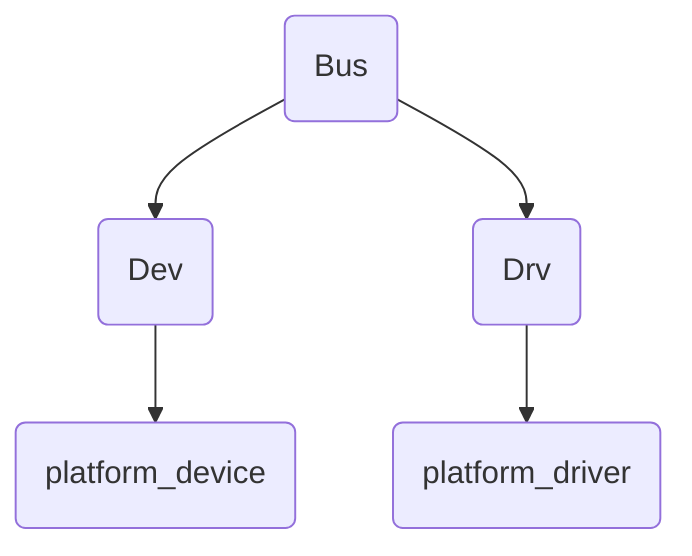
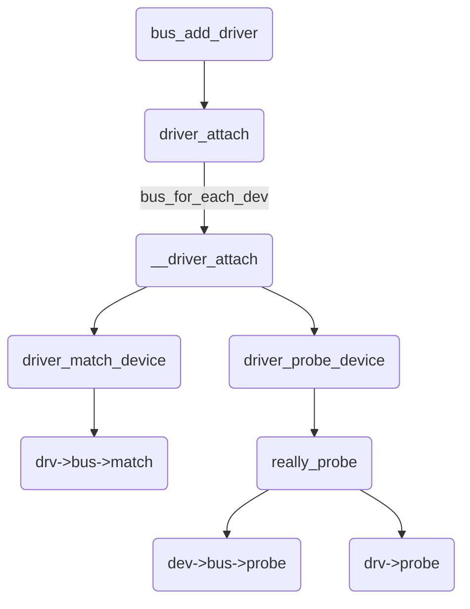
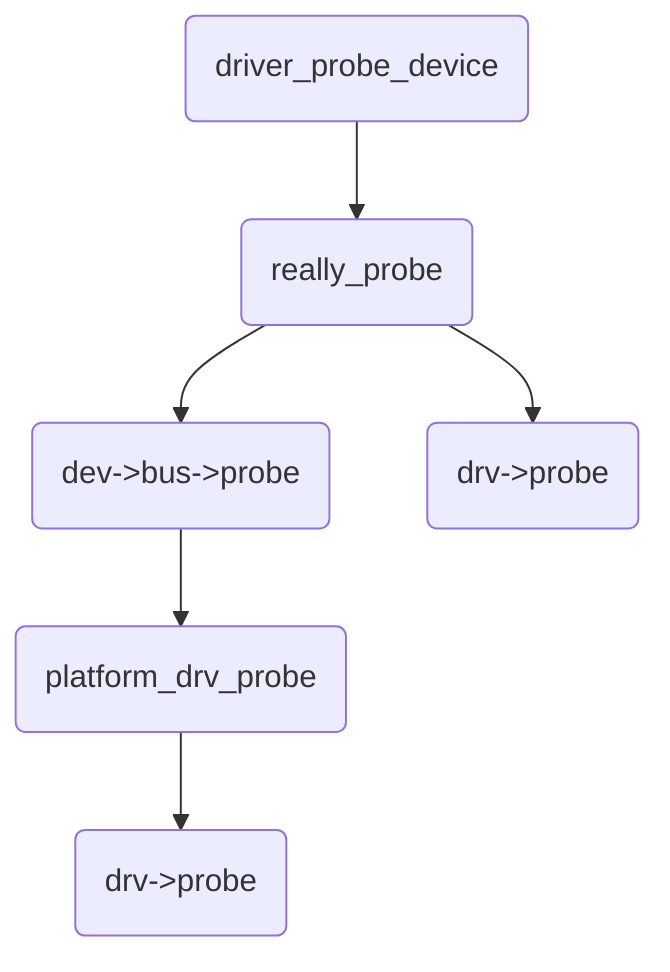
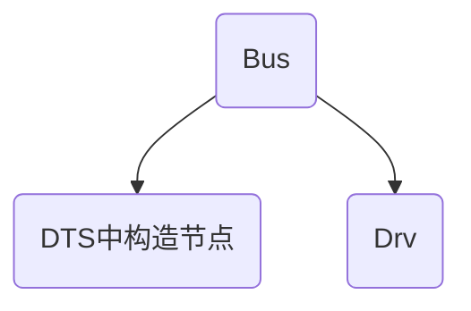
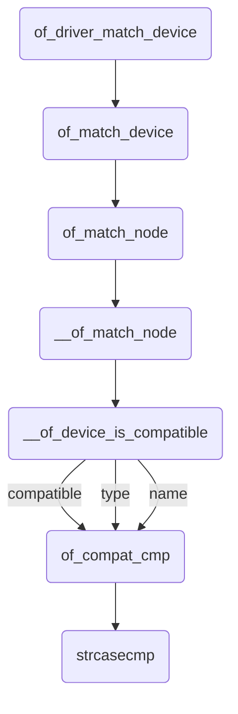

### platform总线设备驱动模型


#### 1. platform总线


Linux设备模型提取了设备操作的共有属性，进行抽象，并将这部分抽象的共有属性在内核中实现，而为需要添加设备和驱动的操作提供了统一的接口，简化了驱动开发过程，只需要熟悉这些统一的接口就可以进行驱动开发；


内核中有个用的比较多的驱动模型，platform平台总线模型，是一条虚拟的总线；在platform总线中，设备用platform_device表示，驱动用platform_driver表示；platform由内核统一管理，在驱动中使用资源，安全性和可移植性高；在硬件部分修改时，只需要修改硬件部分的设备platform_device代码，即可完成硬件适配；


总线、设备、驱动模型





Dev：指定硬件资源


Drv：

1）分配、设置、注册file_operations

2）根据Dev的硬件资源操作硬件


Drv：


	probe，分配、设置、注册file_operations


#### 2. 重要的结构体


struct bus_type


struct platform_device


struct platform_driver


platform_match函数用来比对Dev和Drv是否匹配，如果匹配成功，则调用Drv里的probe函数；


##### bus_type


```c
// include/linux/device.h
struct bus_type {
    const char      *name;	// 总线名称
    const char      *dev_name;
	......
    int (*match)(struct device *dev, struct device_driver *drv);
    int (*uevent)(struct device *dev, struct kobj_uevent_env *env);
    int (*probe)(struct device *dev);
    int (*remove)(struct device *dev);
    void (*shutdown)(struct device *dev);
	......
};
```


##### platform_device


```c
// include/linux/platform_device.h
struct platform_device {
    const char  *name;	// 设备名称，要和platform_driver的name匹配
    int     id;		// 插入总线下相同name的设备编号，一个驱动支持多个设备
    bool        id_auto;
    struct device   dev;
    u32     num_resources;
    struct resource *resource;	// 设备资源，设备硬件信息

    const struct platform_device_id *id_entry;
    char *driver_override; /* Driver name to force a match */

    /* MFD cell pointer */
    struct mfd_cell *mfd_cell;

    /* arch specific additions */
    struct pdev_archdata    archdata;
};
```


##### platform_driver


```c
// include/linux/platform_device.h
struct platform_driver {
    int (*probe)(struct platform_device *);
    int (*remove)(struct platform_device *);
    void (*shutdown)(struct platform_device *);
    int (*suspend)(struct platform_device *, pm_message_t state);
    int (*resume)(struct platform_device *);
    struct device_driver driver;
    const struct platform_device_id *id_table;
    bool prevent_deferred_probe;
};
```


```c
// include/linux/mod_devicetable.h
struct platform_device_id {
    char name[PLATFORM_NAME_SIZE];
    kernel_ulong_t driver_data;
};
```


id_table是一个数组，可以支持一个或多个设备名；数组的最后一个成员应该为空；


#### 3. platform初始化


platform的初始化操作在内核启动时完成，不需要驱动开发者修改；


```c
// drivers/base/platform.c
int __init platform_bus_init(void)
{
    int error;

    early_platform_cleanup();

    error = device_register(&platform_bus);
    if (error)
        return error;
    error = bus_register(&platform_bus_type);
    if (error)
        device_unregister(&platform_bus);
    of_platform_register_reconfig_notifier();
    return error;
}
```


bus_register()


可在sysfs下看到/sys/bus/platform；


```c
// drivers/base/platform.c
struct device platform_bus = {
    .init_name  = "platform",
};
EXPORT_SYMBOL_GPL(platform_bus);
```


```c
// drivers/base/platform.c
struct bus_type platform_bus_type = {
    .name       = "platform",
    .dev_groups = platform_dev_groups,
    .match      = platform_match,
    .uevent     = platform_uevent,
    .pm     = &platform_dev_pm_ops,
};
EXPORT_SYMBOL_GPL(platform_bus_type);
```


#### 4. platform注册


##### 4.1 platform_device注册


```c
// drivers/base/platform.c
int platform_device_register(struct platform_device *pdev)
{
    device_initialize(&pdev->dev);
    arch_setup_pdev_archdata(pdev);
    return platform_device_add(pdev);
}
EXPORT_SYMBOL_GPL(platform_device_register);
```


```c
// drivers/base/platform.c
void platform_device_unregister(struct platform_device *pdev)
{
    platform_device_del(pdev);
    platform_device_put(pdev);
}
EXPORT_SYMBOL_GPL(platform_device_unregister);
```


##### 4.2 platform_driver注册


```c
// include/linux/platform_device.h
#define platform_driver_register(drv) \
    __platform_driver_register(drv, THIS_MODULE)
```


```c
// drivers/base/platform.c
int __platform_driver_register(struct platform_driver *drv,
                struct module *owner)
{
    drv->driver.owner = owner;
    drv->driver.bus = &platform_bus_type;
    drv->driver.probe = platform_drv_probe;
    drv->driver.remove = platform_drv_remove;
    drv->driver.shutdown = platform_drv_shutdown;

    return driver_register(&drv->driver);
}
EXPORT_SYMBOL_GPL(__platform_driver_register);
```


```c
// drivers/base/platform.c
void platform_driver_unregister(struct platform_driver *drv)
{
    driver_unregister(&drv->driver);
}
EXPORT_SYMBOL_GPL(platform_driver_unregister);
```


或者直接使用一个宏代替：


```c
// include/linux/platform_device.h
#define module_platform_driver(__platform_driver) \
    module_driver(__platform_driver, platform_driver_register, \
            platform_driver_unregister)
```


```c
// include/linux/device.h
#define module_driver(__driver, __register, __unregister, ...) \
static int __init __driver##_init(void) \
{ \
    return __register(&(__driver) , ##__VA_ARGS__); \
} \
module_init(__driver##_init); \
static void __exit __driver##_exit(void) \
{ \
    __unregister(&(__driver) , ##__VA_ARGS__); \
} \
module_exit(__driver##_exit);
```





#### 5. match匹配


driver_match_device()函数中的drv->bus->match，就是指向platform_bus_type的match函数指针，即platform_match()函数，用来完成Dev和Drv的匹配；通过Dev中的name和Drv中的id_table->name进行匹配，匹配成功后就会调用Drv中的probe函数；


```c
int (*match)(struct device *dev, struct device_driver *drv);
```


platform_bus_type的match函数指针，被初始化指向platform_match()函数；


```c
// drivers/base/platform.c
struct bus_type platform_bus_type = {
	......
    .match      = platform_match,
	......
};
```


当一个新设备或新驱动添加到总线时，match方法被调用，用于判断指定的驱动程序是否能够处理指定的设备；


```c
// drivers/base/platform.c
static int platform_match(struct device *dev, struct device_driver *drv)
{
    struct platform_device *pdev = to_platform_device(dev);
    struct platform_driver *pdrv = to_platform_driver(drv);

    /* When driver_override is set, only bind to the matching driver */
    if (pdev->driver_override)
        return !strcmp(pdev->driver_override, drv->name);

    /* Attempt an OF style match first */
    if (of_driver_match_device(dev, drv))	// 使用设备树匹配，of表示Open Firmware
        return 1;

    /* Then try ACPI style match */
    if (acpi_driver_match_device(dev, drv))
        return 1;

    /* Then try to match against the id table */
    if (pdrv->id_table)
        return platform_match_id(pdrv->id_table, pdev) != NULL;

    /* fall-back to driver name match */
    return (strcmp(pdev->name, drv->name) == 0);
}
```


如果platform_driver中存在id_table，就通过platform_match_id()函数来比较id_table进行匹配；


```c
// drivers/base/platform.c
static const struct platform_device_id *platform_match_id(
            const struct platform_device_id *id,
            struct platform_device *pdev)
{
    while (id->name[0]) {
        if (strcmp(pdev->name, id->name) == 0) {
            pdev->id_entry = id;
            return id;
        }
        id++;
    }
    return NULL;
}
```


如果platform_driver中有id_table，用platform_device中的const char  *name和platform_driver中的id_table->name比较；


```c
strcmp(pdev->name, id->name);
```


如果platform_driver中没有id_table，用platform_device中的const char  *name和platform_driver中的struct device_driver driver中的name比较；


```c
strcmp(pdev->name, drv->name);
```


优先比较id_table->name


其次比较struct device_driver driver中的name；


如果比较的两个name相同，match就匹配成功，就会调用driver中的probe函数；


#### 6. probe


driver_probe_device()函数通过really_probe()函数，调用drv->bus->probe，就是指向platform_bus_type的probe函数指针，即platform_probe()函数，





#### 7. platform资源


```c
// include/linux/ioport.h
struct resource {
    resource_size_t start;	// 设备在CPU总线的线性起始物理地址
    resource_size_t end;	// 设备在CPU总线的线性结尾物理地址
    const char *name;	// 设备的名称
    unsigned long flags;	// 设备的标志位
    unsigned long desc;
    struct resource *parent, *sibling, *child;
};
```


获取资源


```c
struct resource *platform_get_resource(struct platform_device *dev,
                       unsigned int type, unsigned int num);
```


资源类型


```c
// include/linux/ioport.h
#define IORESOURCE_TYPE_BITS    0x00001f00  /* Resource type */
#define IORESOURCE_IO       0x00000100  /* PCI/ISA I/O ports */
#define IORESOURCE_MEM      0x00000200
#define IORESOURCE_REG      0x00000300  /* Register offsets */
#define IORESOURCE_IRQ      0x00000400
#define IORESOURCE_DMA      0x00000800
#define IORESOURCE_BUS      0x00001000
```


用法


```c
struct platform_device *dev;
struct resource *res;
res = platform_get_resource(dev, IORESOURCE_MEM, 0);
```


#### 8. 实例


```c
platform_device_register();
platform_device_unregister();
```


```c
platform_driver_register();
platform_driver_unregister();
```


```c
struct resource *res;
res = platform_get_resource();
```


### 使用设备树





Dev：在DTS中构造设备节点，指定硬件资源


Drv：

1）分配、设置、注册file_operations

2）根据Dev的硬件资源操作硬件


Drv：


	probe，分配、设置、注册file_operations


dts-->dtb-->


内核解析dtb文件，得到device_node结构体，生成platform_device结构体，其中包含硬件资源，硬件资源来源于DTS文件；


设备树中节点的compatible，用来


reg是寄存器，和内存基本一样


```c
struct resource *res;
res = platform_get_resource
if (res) {
    led_pin = ;
} else {
    of_property_read_s32(platform_device->dev.of_node, "pin", &ledpin);
}
```


```c
// drivers/base/platform.c
static int platform_match(struct device *dev, struct device_driver *drv)
{
    struct platform_device *pdev = to_platform_device(dev);
    struct platform_driver *pdrv = to_platform_driver(drv);

    /* When driver_override is set, only bind to the matching driver */
    if (pdev->driver_override)
        return !strcmp(pdev->driver_override, drv->name);

    /* Attempt an OF style match first */
    if (of_driver_match_device(dev, drv))	// 使用设备树匹配
        return 1;

    /* Then try ACPI style match */
    if (acpi_driver_match_device(dev, drv))
        return 1;

    /* Then try to match against the id table */
    if (pdrv->id_table)
        return platform_match_id(pdrv->id_table, pdev) != NULL;

    /* fall-back to driver name match */
    return (strcmp(pdev->name, drv->name) == 0);
}
```


```c
static inline int of_driver_match_device(struct device *dev,
                     const struct device_driver *drv)
{
    return of_match_device(drv->of_match_table, dev) != NULL;
}
```


```c
struct device_driver {
    const char      *name;
    struct bus_type     *bus;
	......
	const struct of_device_id   *of_match_table;
};
```


```c
// include/linux/mod_devicetable.h
struct of_device_id {
    char    name[32];
    char    type[32];
    char    compatible[128];
    const void *data;
};
```


```c
// drivers/of/device.c
const struct of_device_id *of_match_device(const struct of_device_id *matches,
                       const struct device *dev)
{
    if ((!matches) || (!dev->of_node))
        return NULL;
    return of_match_node(matches, dev->of_node);
}
EXPORT_SYMBOL(of_match_device);
```


```c
// drivers/of/base.c
const struct of_device_id *of_match_node(const struct of_device_id *matches,
                     const struct device_node *node)
{
    const struct of_device_id *match;
    unsigned long flags;

    raw_spin_lock_irqsave(&devtree_lock, flags);
    match = __of_match_node(matches, node);
    raw_spin_unlock_irqrestore(&devtree_lock, flags);
    return match;
}
EXPORT_SYMBOL(of_match_node);
```


```c
// drivers/of/base.c
const struct of_device_id *__of_match_node(const struct of_device_id *matches,
                       const struct device_node *node)
{
    const struct of_device_id *best_match = NULL;
    int score, best_score = 0;

    if (!matches)
        return NULL;

    for (; matches->name[0] || matches->type[0] || matches->compatible[0]; matches++) {
        score = __of_device_is_compatible(node, matches->compatible,
                          matches->type, matches->name);
        if (score > best_score) {
            best_match = matches;
            best_score = score;
        }
    }

    return best_match;
}
```


设备树和驱动的匹配过程如下：





__of_match_node()函数，把device_driver的of_match_table（struct of_device_id）和device里的of_node（struct device_node）进行匹配；


匹配方式是，在__of_device_is_compatible()函数里，分别调用of_compat_cmp()函数对两者的compatible、type、name字符串进行对比，compatible、type、name字符串要同时相同；一般情况下，name、type为空，只比较compatible字符串；比较compatible字符串时是比较整个字符串；这里的比较不是单纯的比较，是采用的加分制；


platform_device


	struct device dev;


		of_node


对于dts生成的platform_device，dev中含有of_node；


of_node中含有的属性，取决于设备树；比如：compatible、reg、pin属性；


compatible属性和of_match_table中的compatible进行比对；


优先比较：compatible，


#### 参考资料


https://www.jianshu.com/p/6325f723509b


[回到目录](目录)