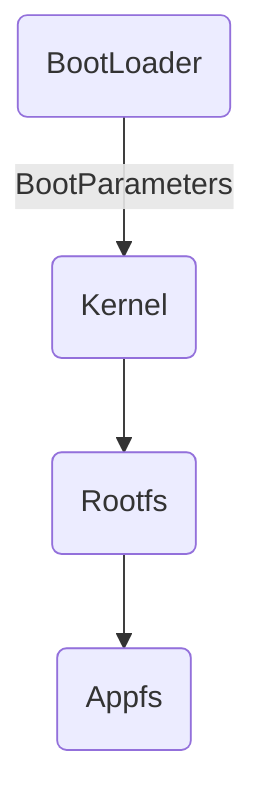

# Qemu搭建ARM vexpress开发环境(2)----u-boot启动kernel


## 目录

[TOC]

在上文《[Qemu搭建ARM vexpress开发环境(1)](https://www.jianshu.com/p/94833e841742)》中已经简单讲述了通过Qemu直接启动Linux内核，并挂载SD卡根文件系统的方法，这种方法是直接启动内核，与实际应用中ARM板的启动方式：u-boot、kernel、rootfs有些不同。现在就来讲述下用Qemu搭建通过u-boot启动Linux内核并挂载根文件系统的方法。

<!--more-->


## 1. 简述

嵌入式系统要正常运行，应该包含：u-boot、kernel、rootfs、appfs。这几部分在ARM开发板Flash上的位置关系应该类似于下图所示：

| BootLoader | BootParameters | Kernel | Rootfs | Appfs |
| :--------: | :------------: | :----: | :----: | :---: |


嵌入式系统的启动流程如下：



rootfs可以添加到开发板的Flash，也可以不用添加到开发板，而是部署到PC机上，开发板在运行完kernel，要挂载rootfs时，可以通过NFS网络挂载到设定好的PC机上的rootfs根文件系统上（下一篇文章《Qemu搭建ARM vexpress开发环境(三)----NFS网络根文件系统》会详细讲解NFS网络挂载根文件系统的具体操作方法）。


## 2. 准备u-boot


用来使用u-boot启动加载Linux内核


### 2.1 下载u-boot

从 http://ftp.denx.de/pub/u-boot 网站选择一个u-boot版本源码下载，本文中使用的是u-boot-2020.01版本。


### 2.2 解压u-boot

解压u-boot:
```shell
# tar -xvf u-boot-2020.01.tar.bz2
```


### 2.3 编译u-boot


#### 2.3.1 配置时碰到的问题


##### 配置命令

```shell
# make ARCH=arm CROSS_COMPILE=arm-linux-gnueabi- vexpress_ca9x4_defconfig
```


如果没有修改Makefile和config.mk文件，需要在编译时加上ARCH和CROSS_COMPILE的配置；在编译u-boot时可能会出现一些问题，只要逐个问题解决就可以编译完成了；

```shell
/bin/sh: 1: bison: not found
scripts/Makefile.lib:226: recipe for target 'scripts/kconfig/zconf.tab.c' failed
make[1]: *** [scripts/kconfig/zconf.tab.c] Error 127
Makefile:539: recipe for target 'vexpress_ca9x4_defconfig' failed
make: *** [vexpress_ca9x4_defconfig] Error 2
```


```shell
# sudo apt-get install bison
```


```shell
/bin/sh: 1: flex: not found
scripts/Makefile.lib:218: recipe for target 'scripts/kconfig/zconf.lex.c' failed
make[1]: *** [scripts/kconfig/zconf.lex.c] Error 127
Makefile:539: recipe for target 'vexpress_ca9x4_defconfig' failed
make: *** [vexpress_ca9x4_defconfig] Error 2
```


```shell
# sudo apt-get install flex
```


```shell
# make vexpress_ca9x4_defconfig ARCH=arm CROSS_COMPILE=arm-linux-gnueabi- O=./object
# make ARCH=arm CROSS_COMPILE=arm-linux-gnueabi- O=./object -j4
scripts/kconfig/conf  --syncconfig Kconfig
  CHK     include/config.h
  GEN     include/autoconf.mk.dep
  CFG     u-boot.cfg
  GEN     include/autoconf.mk
*** Your GCC is older than 6.0 and is not supported
arch/arm/config.mk:66: recipe for target 'checkgcc6' failed
make: *** [checkgcc6] Error 1
```


```shell
# vim arch/arm/config.mk
ifeq ($(CONFIG_$(SPL_)SYS_THUMB_BUILD),y)
#archprepare: checkthumb checkgcc6
archprepare: checkthumb
checkthumb:
        @if test "$(call cc-name)" = "gcc" -a \
                        "$(call cc-version)" -lt "0404"; then \
                echo -n '*** Your GCC does not produce working '; \
                echo 'binaries in THUMB mode.'; \
                echo '*** Your board is configured for THUMB mode.'; \
                false; \
        fi
#else
#archprepare: checkgcc6
endif

#checkgcc6:
#        @if test "$(call cc-name)" = "gcc" -a \
#                        "$(call cc-version)" -lt "0600"; then \
#                echo '*** Your GCC is older than 6.0 and is not supported'; \
#                false; \
#        fi
```


#### 2.3.2 生成配置文件

```shell
# make vexpress_ca9x4_defconfig ARCH=arm CROSS_COMPILE=arm-linux-gnueabi- O=./object
make[1]: Entering directory '/home/xiami/tool/u-boot-2020.01/object'
  HOSTCC  scripts/basic/fixdep
  GEN     ./Makefile
  HOSTCC  scripts/kconfig/conf.o
  YACC    scripts/kconfig/zconf.tab.c
  LEX     scripts/kconfig/zconf.lex.c
  HOSTCC  scripts/kconfig/zconf.tab.o
  HOSTLD  scripts/kconfig/conf
#
# configuration written to .config
#
make[1]: Leaving directory '/home/xiami/tool/u-boot-2020.01/object'
```


./configs/vexpress_ca9x4_defconfig


```shell
# ls object/.config -l
-rw-r--r-- 1 xiami xiami 22698 Mar 17 23:20 object/.config
```


如果需要修改配置文件中的一些选项，可以通过以下界面操作选择：

```shell
# make menuconfig ARCH=arm CROSS_COMPILE=arm-linux-gnueabi- O=./object
```


#### 2.3.3 编译

```shell
# make ARCH=arm CROSS_COMPILE=arm-linux-gnueabi- -j4 O=./object
```


#### 2.3.4 简化编译过程

这种方式编译比较直接，但是在调试时，需要多次编译u-boot，参数太多会带来不便，于是可以通过以下方法，修改Makefile和config.mk文件中的ARCH和CROSS_COMPILE选项，在编译的时候就可以省去了在编译命令中添加编译配置的设置。

修改Makefile
```shell
# vim Makefile
CROSS_COMPILE = arm-linux-gnueabi-
```
修改config.mk
```shell
# vim config.mk
ARCH = arm
```


编译u-boot:
```shell
# make vexpress_ca9x4_defconfig
# make -j4
```


### 2.4 启动u-boot

通过Qemu启动命令启动u-boot：
```shell
# qemu-system-arm -M vexpress-a9 -m 512M -nographic -kernel ./u-boot

U-Boot 2020.01 (Mar 17 2020 - 23:21:36 +0800)

DRAM:  512 MiB
WARNING: Caches not enabled
Flash: 128 MiB
MMC:   MMC: 0
*** Warning - bad CRC, using default environment

In:    serial
Out:   serial
Err:   serial
Net:   smc911x-0
Hit any key to stop autoboot:  0 
=>
```

查看u-boot的版本：

```shell
=> version
U-Boot 2020.01 (Mar 20 2020 - 23:01:23 +0800)

arm-linux-gnueabi-gcc (Ubuntu/Linaro 7.5.0-3ubuntu1~18.04) 7.5.0
GNU ld (GNU Binutils for Ubuntu) 2.30
```


打印u-boot的环境变量：
```shell
=> print
arch=arm
baudrate=38400
board=vexpress
board_name=vexpress
......
scriptaddr=0x88000000
stderr=serial
stdin=serial
stdout=serial
vendor=armltd

Environment size: 2656/262140 bytes
```

至此，u-boot启动成功，下一步开始配置u-boot的内核启动参数，来启动Linux内核，并挂在根文件系统。


## 3. 准备内核


### 3.1 指定加载地址

使用u-boot引导内核启动，需要内核的uImage镜像：

> 需要将内核编译为uImage格式，需要指定uImage在内存中的加载地址，编译内核时指定：make LOADADDR=? uImage -j4


如果不指定LOADADDR参数，编译时会报错，如下：

```shell
# make ARCH=arm CROSS_COMPILE=arm-linux-gnueabi- uImage -j4 O=./object
make[1]: Entering directory '/home/xiami/tool/linux-4.14.172/object'
......
  Kernel: arch/arm/boot/Image is ready
  Kernel: arch/arm/boot/zImage is ready
multiple (or no) load addresses: 
This is incompatible with uImages
Specify LOADADDR on the commandline to build an uImage
../arch/arm/boot/Makefile:79: recipe for target 'arch/arm/boot/uImage' failed
make[2]: *** [arch/arm/boot/uImage] Error 1
arch/arm/Makefile:338: recipe for target 'uImage' failed
make[1]: *** [uImage] Error 2
make[1]: Leaving directory '/home/xiami/tool/linux-4.14.172/object'
Makefile:146: recipe for target 'sub-make' failed
make: *** [sub-make] Error 2
```


在内核目录直接编译：
```shell
# make LOADADDR=0x60003000 uImage -j4
```


```shell
# make ARCH=arm CROSS_COMPILE=arm-linux-gnueabi- LOADADDR=0x60003000 uImage -j4 O=./object
make[1]: Entering directory '/home/xiami/tool/linux-4.14.172/object'
......
  Kernel: arch/arm/boot/Image is ready
  Kernel: arch/arm/boot/zImage is ready
  UIMAGE  arch/arm/boot/uImage
"mkimage" command not found - U-Boot images will not be built
../arch/arm/boot/Makefile:79: recipe for target 'arch/arm/boot/uImage' failed
make[2]: *** [arch/arm/boot/uImage] Error 1
arch/arm/Makefile:338: recipe for target 'uImage' failed
make[1]: *** [uImage] Error 2
make[1]: Leaving directory '/home/xiami/tool/linux-4.14.172/object'
Makefile:146: recipe for target 'sub-make' failed
make: *** [sub-make] Error 2
```


第一次编译会报错，提示没有找到mkimage工具，需要手动安装u-boot-tools即可；

```shell
# sudo apt-get install u-boot-tools
```


### 3.2 编译uImage

```shell
# make ARCH=arm CROSS_COMPILE=arm-linux-gnueabi- LOADADDR=0x60003000 uImage -j4 O=./object
make[1]: Entering directory '/home/xiami/tool/linux-4.14.172/object'
......
Load Address: 60003000
Entry Point:  60003000
  Kernel: arch/arm/boot/uImage is ready
make[1]: Leaving directory '/home/xiami/tool/linux-4.14.172/object'
```


或者在Makefile中添加加载地址配置：

```shell
# vim arch/arm/boot/Makefile
LOADADDR ?= 0x60003000
```
再编译生成uImage文件:
```shell
# make uImage -j4
```


## 4. Qemu网络功能设置

Qemu虚拟机在u-boot启动时，需要将uImage加载到内存，而uImage从哪里来？可以通过TFTP服务器下载uImage到内存指定地址。而在这之前需要通过桥接方式将网络链接到Ubuntu系统。


### 4.1 配置Qemu与主机的网络连接


采用桥接网络连接Host主机通信
主机内核需要支持tun/tap模块


### 4.2 配置Ubuntu主机

#### 1) 安装工具

安装桥接网络依赖的两个工具：
```shell
# sudo apt install uml-utilities bridge-utils
```

创建tun设备文件：/dev/net/tun（一般会自动创建）

```shell
# ls /dev/net/tun -l
crw-rw-rw- 1 root root 10, 200 Mar 20 21:31 /dev/net/tun
```


#### 2) 配置网络

修改/etc/network/interfaces文件配置网络

```shell
# sudo vim /etc/network/interfaces
# interfaces(5) file used by ifup(8) and ifdown(8)
auto lo
iface lo inet loopback

auto br0
iface br0 inet dhcp
bridge_ports enp0s25
```


#### 3) 添加网络配置脚本

配置/etc/qemu-ifup、/etc/qemu-ifdown脚本；

默认情况下，当qemu使用tap设备时，会执行/etc/qemu-ifup和/etc/qemu-ifdown这两个脚本；需要创建这两个脚本，并加上可执行权限；

```shell
# cat /etc/qemu-ifup
#!/bin/sh

echo sudo tunctl -u $(id -un) -t $1
sudo tunctl -u $(id -un) -t $1

echo sudo ifconfig $1 0.0.0.0 promisc up
sudo ifconfig $1 0.0.0.0 promisc up

echo sudo brctl addif br0 $1
sudo brctl addif br0 $1

echo brctl show
brctl show

# sudo ifconfig br0 192.168.1.102
```


```shell
# ifconfig
enp0s25: flags=4163<UP,BROADCAST,RUNNING,MULTICAST>  mtu 1500
        inet 192.168.1.102  netmask 255.255.255.0  broadcast 192.168.1.255
        inet6 ****::***:****:****:****  prefixlen 64  scopeid 0x20<link>
        ether **:**:**:**:**:**  txqueuelen 1000  (Ethernet)
        RX packets 146587  bytes 69384714 (69.3 MB)
        RX errors 0  dropped 0  overruns 0  frame 0
        TX packets 117583  bytes 13689404 (13.6 MB)
        TX errors 0  dropped 0 overruns 0  carrier 0  collisions 0
        device interrupt 20  memory 0xf3900000-f3920000  
```


查询到enp0s25的IP地址是192.168.1.102，需要将br0配置在同一个192.168.1.***网段；

```shell
# cat /etc/qemu-ifdown
#!/bin/sh

echo sudo brctl delif br0 $1
sudo brctl delif br0 $1

echo sudo tunctl -d $1
sudo tunctl -d $1
 
echo brctl show
brctl show
```


```shell
# chmod a+x /etc/qemu-ifup
# chmod a+x /etc/qemu-ifdown
```

重启PC，使新的/etc/network/interfaces配置文件生效；


### 4.3 关闭防火墙


#### 1) 关闭防火墙

```shell
# sudo ufw disable
Firewall stopped and disabled on system startup
```


#### 2) 查看当前防火墙状态

```shell
# sudo ufw status
Status: inactive
```


另外，附上开启防火墙的操作方法：

```shell
# ufw enable
```


### 4.4 重启系统，使配置生效

```shell
# reboot
```
或者：
```shell
# init 6
```


### 4.5 查看Qemu的网络环境

```shell
# ifconfig
br0: flags=4163<UP,BROADCAST,RUNNING,MULTICAST>  mtu 1500
        inet 192.168.1.102  netmask 255.255.255.0  broadcast 192.168.1.255
        inet6 ****::***:****:****:****  prefixlen 64  scopeid 0x20<link>
        ether **:**:**:**:**:**  txqueuelen 1000  (Ethernet)
        RX packets 44667  bytes 16853864 (16.8 MB)
        RX errors 0  dropped 0  overruns 0  frame 0
        TX packets 45161  bytes 32391098 (32.3 MB)
        TX errors 0  dropped 0 overruns 0  carrier 0  collisions 0
```

虚拟网口br0即Qemu虚拟机与Linux主机通讯的网口；

在u-boot中测试网络是否接通：

```shell
=> ping 192.168.1.102
smc911x: MAC 52:54:00:12:34:56
smc911x: detected LAN9118 controller
smc911x: phy initialized
smc911x: MAC 52:54:00:12:34:56
Using smc911x-0 device
smc911x: MAC 52:54:00:12:34:56
host 192.168.1.102 is alive
```


## 5. 安装TFTP服务器

创建TFTP服务器，用来给Qemu模拟开发板启动uImage时，下载uImage到内存中。


### 5.1 安装TFTP工具


安装Linux主机Host的TFTP服务器工具：

```shell
# sudo apt install tftp-hpa tftpd-hpa xinetd
```


### 5.2 配置


#### 1) 修改配置文件，设置TFTP服务器目录

```shell
# sudo vim /etc/default/tftpd-hpa
......
TFTP_USERNAME="xiami"
TFTP_DIRECTORY="/home/xiami/qemu/boot-uboot"
TFTP_ADDRESS="0.0.0.0:69"
TFTP_OPTIONS="-l -c -s"
......
```


> 说明：
>
> TFTP_USERNAME：必须设置为当前的用户名，或：root
>
> TFTP_DIRECTORY：设定TFTP的根目录
>
> TFTP_ADDRESS：
>
> TFTP_OPTIONS：TFTP启动参数
>
> ​	-l: 以standalone/listen模式启动TFTP服务，而不是从inetd启动，不需要安装xinetd
>
> ​	-c: 可创建新文件，默认，TFTP只允许覆盖原文件，不能创建新文件
>
> ​	-s: 改变TFTP启动的根目录；加入-s后，客户端使用TFTP时，不再需要输入指定目录，填写文件的完整路径，而是使用配置文件中写好的目录；


#### 2) Linux主机上创建tftp目录

```shell
# mkdir /home/mcy/tftpboot
# chmod 777 /home/mcy/tftpboot
```


#### 3) 重启tftp服务

```powershell
# sudo /etc/init.d/tftpd-hpa restart
[ ok ] Restarting tftpd-hpa (via systemctl): tftpd-hpa.service.
```


### 5.3 测试验证

#### 1) 测试tftp服务器

可以使用三种方法，1. 输入真实的IP地址；2. 用localhost代替主机；3. 使用地址127.0.0.1，这个IP地址始终代表本机IP；

tftp 192.168.1.102

tftp localhost

tftp 127.0.0.1


#### 2) TFTP命令行的基本命令

put: 将文件上传到TFTP根目录

get: 取得TFTP根目录上的文件

quit/q: 退出TFTP服务


## 6. 设置u-boot中的内核启动参数


### 6.1 设置u-boot参数

u-boot能够正常启动还不足以引导内核启动，需要在u-boot中设置一些启动参数，在引导内核启动时，将这些启动参数传递给内核；内核启动后挂载SD卡中的文件系统；

这些启动参数，可以在u-boot启动后，手动设置，也可以在u-boot中，把内核启动参数写入vexpress_common.h头文件；


#### 1） 写入u-boot头文件

修改vexpress_common.h头文件，添加内核启动需要的参数：

```c
# vim include/configs/vexpress_common.h
#define CONFIG_BOOTCOMMAND  \
    "tftp 0x60003000 uImage; tftp 0x60500000 vexpress-v2p-ca9.dtb;  \
    setenv bootargs 'root=/dev/mmcblk0 rw   \
    init=/linuxrc   \
    ip=192.168.1.110 console=ttyAMA0';  \
    bootm 0x60003000 - 0x60500000;"

#define CONFIG_IPADDR   192.168.1.110
#define CONFIG_SERVERIP 192.168.1.104
#define CONFIGN_NETMASK 255.255.255.0
```

参数说明：

> CONFIG_IPADDR： 设备的本地IP地址
>
> CONFIG_SERVERIP： TFTP下载时的服务器IP地址
>
> CONFIG_BOOTCOMMAND： 内核启动的参数设置，包含boot_args


#### 2） 手动设置

在u-boot启动之后，手动设置环境变量：

```shell
=> setenv ipaddr 192.168.1.110
=> setenv serverip 192.168.1.102
=> setenv bootargs 'root=/dev/mmcblk0 rw init=/linuxrc ip=192.168.1.110 console=ttyAMA0'
```

手动设置tftp下载：

```shell
=> tftp 0x60003000 uImage	// tftp下载内核镜像
=> tftp 0x60500000 vexpress-v2p-ca9.dtb		// tftp下载设备树
=> bootm 0x60003000 - 0x60500000	// 启动内核
```

手动设置用来调试比较方便，但是正常使用时，还是将设置参数写入u-boot的vexpress_common.h头文件比较好，免得每次启动都需要输入这么多命令；


#### 3） 设置挂载nfs网络文件系统

如果需要通过nfs挂载网络文件系统，需要在u-boot中，设置boot_args，如下：


```c
# vim include/configs/vexpress_common.h

#define CONFIG_BOOTCOMMAND  \
    "tftp 0x60003000 uImage; tftp 0x60500000 vexpress-v2p-ca9.dtb;  \
    setenv bootargs 'root=/dev/nfs rw   \
    nfsroot=192.168.1.102:/home/xiami/qemu/nfs_root init=/linuxrc   \
    ip=192.168.1.110 console=ttyAMA0';  \
    bootm 0x60003000 - 0x60500000;"

#define CONFIG_IPADDR   192.168.1.110
#define CONFIG_SERVERIP 192.168.1.104
#define CONFIGN_NETMASK 255.255.255.0
```


重新编译u-boot；启动Qemu验证

```shell
=> print bootcmd
bootcmd=tftp 0x60003000 uImage; tftp 0x60500000 vexpress-v2p-ca9.dtb; setenv bootargs 'root=/dev/nfs rw nfsroot=192.168.1.102:/home/xiami/qemu/boot-uboot/rootfs init=/linuxrc ip=192.168.1.110 console=ttyAMA0'; bootm 0x60003000 - 0x60500000;
=> print ipaddr
ipaddr=192.168.1.110
=> print serverip
serverip=192.168.1.102
```

网络还没有ping通：

```shell
=> ping 192.168.1.102
smc911x: MAC 52:54:00:12:34:56
smc911x: detected LAN9118 controller
smc911x: phy initialized
smc911x: MAC 52:54:00:12:34:56
Using smc911x-0 device

ARP Retry count exceeded; starting again
smc911x: MAC 52:54:00:12:34:56
ping failed; host 192.168.1.102 is not alive
```

这部分在下一节中再讲述，此处略过；


### 6.2 启动验证

#### 1） 启动Qemu，并检查启动参数

```powershell
# cat boot.sh
#! /bin/sh
sudo qemu-system-arm \
	-M vexpress-a9 \
	-m 512M \
	-kernel ./u-boot \
	-nographic \
	-append console=ttyAMA0 \
	-sd rootfs.ext3 \
	-net nic \
	-net tap
```


u-boot启动后，查看u-boot中的环境变量：

```shell
=> print bootcmd
bootcmd=tftp 0x60003000 uImage; tftp 0x60500000 vexpress-v2p-ca9.dtb; setenv bootargs 'root=/dev/mmcblk0 rw init=/linuxrc ip=192.168.1.110 console=ttyAMA0'; bootm 0x60003000 - 0x60500000;
=> print ipaddr
ipaddr=192.168.1.110
=> print serverip
serverip=192.168.1.102
```


检查tftp下载网络，在开发板的u-boot中，ping本地PC的tftp服务器，注意，不要用电脑ping开发板，因为u-boot中没有回应机制，是ping不通开发板的；

```shell
=> ping 192.168.1.102
smc911x: MAC 52:54:00:12:34:56
smc911x: detected LAN9118 controller
smc911x: phy initialized
smc911x: MAC 52:54:00:12:34:56
Using smc911x-0 device
smc911x: MAC 52:54:00:12:34:56
host 192.168.1.102 is alive
```


#### 2） 启动验证


```
# ./boot-uboot-tftp.sh 
Booting qemu vexpress-ca9
WARNING: Image format was not specified for 'rootfs.ext3' and probing guessed raw.
         Automatically detecting the format is dangerous for raw images, write operations on block 0 will be restricted.
         Specify the 'raw' format explicitly to remove the restrictions.
sudo tunctl -u root -t tap0
TUNSETIFF: Device or resource busy
sudo ifconfig tap0 0.0.0.0 promisc up
sudo brctl addif br0 tap0
brctl show
bridge name	bridge id		STP enabled	interfaces
br0		8000.0021ccd65a96	no		enp0s25
							tap0

U-Boot 2020.01 (Mar 22 2020 - 16:51:32 +0800)

DRAM:  512 MiB
WARNING: Caches not enabled
Flash: 128 MiB
MMC:   MMC: 0
*** Warning - bad CRC, using default environment

In:    serial
Out:   serial
Err:   serial
Net:   smc911x-0
Hit any key to stop autoboot:  0 
smc911x: MAC 52:54:00:12:34:56
smc911x: detected LAN9118 controller
smc911x: phy initialized
smc911x: MAC 52:54:00:12:34:56
Using smc911x-0 device
TFTP from server 192.168.1.102; our IP address is 192.168.1.110
Filename 'uImage'.
Load address: 0x60003000
Loading: #################################################################
	 #################################################################
	 #################################################################
	 #################################################################
	 ###########
	 8.7 MiB/s
done
Bytes transferred = 3971576 (3c99f8 hex)
smc911x: MAC 52:54:00:12:34:56
smc911x: MAC 52:54:00:12:34:56
smc911x: detected LAN9118 controller
smc911x: phy initialized
smc911x: MAC 52:54:00:12:34:56
Using smc911x-0 device
TFTP from server 192.168.1.102; our IP address is 192.168.1.110
Filename 'vexpress-v2p-ca9.dtb'.
Load address: 0x60500000
Loading: ##
	 4.7 MiB/s
done
Bytes transferred = 14692 (3964 hex)
smc911x: MAC 52:54:00:12:34:56
## Booting kernel from Legacy Image at 60003000 ...
   Image Name:   Linux-4.14.172
   Image Type:   ARM Linux Kernel Image (uncompressed)
   Data Size:    3971512 Bytes = 3.8 MiB
   Load Address: 60003000
   Entry Point:  60003000
   Verifying Checksum ... OK
## Flattened Device Tree blob at 60500000
   Booting using the fdt blob at 0x60500000
   Loading Kernel Image
   Loading Device Tree to 7fe81000, end 7fe87963 ... OK

Starting kernel ...

Booting Linux on physical CPU 0x0
Linux version 4.14.172 (xiami@xiami) (gcc version 7.5.0 (Ubuntu/Linaro 7.5.0-3ubuntu1~18.04)) #1 SMP Sun Mar 15 12:27:54 CST 2020
CPU: ARMv7 Processor [410fc090] revision 0 (ARMv7), cr=10c5387d
CPU: PIPT / VIPT nonaliasing data cache, VIPT nonaliasing instruction cache
OF: fdt: Machine model: V2P-CA9
Memory policy: Data cache writeback
CPU: All CPU(s) started in SVC mode.
percpu: Embedded 15 pages/cpu s32396 r8192 d20852 u61440
Built 1 zonelists, mobility grouping on.  Total pages: 130048
Kernel command line: root=/dev/mmcblk0 rw       init=/linuxrc       ip=192.168.1.110 console=ttyAMA0
log_buf_len individual max cpu contribution: 4096 bytes
log_buf_len total cpu_extra contributions: 12288 bytes
log_buf_len min size: 16384 bytes
log_buf_len: 32768 bytes
early log buf free: 14980(91%)
PID hash table entries: 2048 (order: 1, 8192 bytes)
Dentry cache hash table entries: 65536 (order: 6, 262144 bytes)
Inode-cache hash table entries: 32768 (order: 5, 131072 bytes)
Memory: 509616K/524288K available (6144K kernel code, 403K rwdata, 1372K rodata, 1024K init, 161K bss, 14672K reserved, 0K cma-reserved)
Virtual kernel memory layout:
    vector  : 0xffff0000 - 0xffff1000   (   4 kB)
    fixmap  : 0xffc00000 - 0xfff00000   (3072 kB)
    vmalloc : 0xa0800000 - 0xff800000   (1520 MB)
    lowmem  : 0x80000000 - 0xa0000000   ( 512 MB)
    modules : 0x7f000000 - 0x80000000   (  16 MB)
      .text : 0x80008000 - 0x80700000   (7136 kB)
      .init : 0x80900000 - 0x80a00000   (1024 kB)
      .data : 0x80a00000 - 0x80a64f90   ( 404 kB)
       .bss : 0x80a6bd00 - 0x80a94468   ( 162 kB)
SLUB: HWalign=64, Order=0-3, MinObjects=0, CPUs=4, Nodes=1
Hierarchical RCU implementation.
	RCU event tracing is enabled.
	RCU restricting CPUs from NR_CPUS=8 to nr_cpu_ids=4.

......

IP-Config: Guessing netmask 255.255.255.0
IP-Config: Complete:
     device=eth0, hwaddr=52:54:00:12:34:56, ipaddr=192.168.1.110, mask=255.255.255.0, gw=255.255.255.255
     host=192.168.1.110, domain=, nis-domain=(none)
     bootserver=255.255.255.255, rootserver=255.255.255.255, rootpath=
ALSA device list:
  #0: ARM AC'97 Interface PL041 rev0 at 0x10004000, irq 30
EXT4-fs (mmcblk0): mounting ext3 file system using the ext4 subsystem
random: fast init done
EXT4-fs (mmcblk0): recovery complete
EXT4-fs (mmcblk0): mounted filesystem with ordered data mode. Opts: (null)
VFS: Mounted root (ext3 filesystem) on device 179:0.
Freeing unused kernel memory: 1024K
random: crng init done
Hello Linux Qemu!

Please press Enter to activate this console. 
/ # 
```


```
=> reset
resetting ...


U-Boot 2017.05 (Jul 24 2019 - 21:52:28 +0800)

DRAM:  512 MiB
WARNING: Caches not enabled
Flash: 128 MiB
MMC:   MMC: 0
*** Warning - bad CRC, using default environment

In:    serial
Out:   serial
Err:   serial
Net:   smc911x-0
Hit any key to stop autoboot:  0 
smc911x: MAC 52:54:00:12:34:56
smc911x: detected LAN9118 controller
smc911x: phy initialized
smc911x: MAC 52:54:00:12:34:56
Using smc911x-0 device
TFTP from server 192.168.1.104; our IP address is 192.168.1.110
Filename 'uImage'.
Load address: 0x60003000
Loading: #################################################################
	 #################################################################
	 #################################################################
	 ##################################################
	 1.3 MiB/s
done
Bytes transferred = 3581920 (36a7e0 hex)
smc911x: MAC 52:54:00:12:34:56
smc911x: MAC 52:54:00:12:34:56
smc911x: detected LAN9118 controller
smc911x: phy initialized
smc911x: MAC 52:54:00:12:34:56
Using smc911x-0 device
TFTP from server 192.168.1.104; our IP address is 192.168.1.110
Filename 'vexpress-v2p-ca9.dtb'.
Load address: 0x60500000
Loading: #
	 250 KiB/s
done
Bytes transferred = 14360 (3818 hex)
smc911x: MAC 52:54:00:12:34:56
## Booting kernel from Legacy Image at 60003000 ...
   Image Name:   Linux-4.4.157
   Image Type:   ARM Linux Kernel Image (uncompressed)
   Data Size:    3581856 Bytes = 3.4 MiB
   Load Address: 60003000
   Entry Point:  60003000
   Verifying Checksum ... OK
## Flattened Device Tree blob at 60500000
   Booting using the fdt blob at 0x60500000
   Loading Kernel Image ... OK
   Loading Device Tree to 7fed4000, end 7feda817 ... OK


```

至此，通过u-boot加载kernel，并挂载SD卡文件系统已经成功；


### 7. 总结

SD卡中rootfs目录是一个简易的根文件系统，可以将它制作成一个镜像文件，将镜像文件烧写到开发板，或者通过Qemu中的u-boot启动Linux内核后挂载到镜像文件上。也可以设置为通过NFS网络文件系统启动，参考下一篇文章《[Qemu搭建ARM vexpress开发环境(3)----NFS网络根文件系统](https://www.jianshu.com/p/cf46f7225db6)》。


